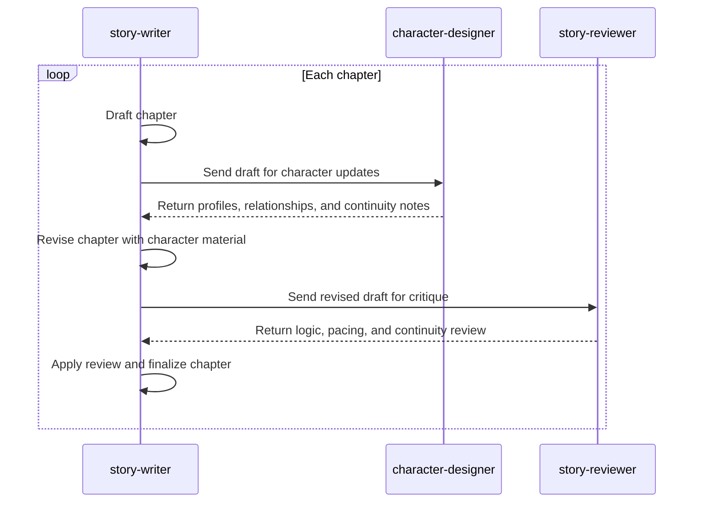

# Creative Writing Team

This example is the creative writing team scenario for [`igamenovoer/houmao`](https://github.com/igamenovoer/houmao), a framework and CLI toolkit for orchestrating teams of loosely coupled AI agents.

Instead of asking one agent to write everything, the workflow splits authorship, character continuity, and critique across specialized agents. The result is a compact demonstration of Houmao's core model: one managed agent owns the run, delegates bounded work through mailbox-backed coordination, and gathers artifacts on disk.

## Team Roles

- `story-writer`: lead writer, loop owner, and final decision maker for each chapter.
- `character-designer`: character specialist responsible for profiles, relationship notes, and continuity details.
- `story-reviewer`: critique specialist responsible for logic, pacing, consistency, and story-level review.

## Collaboration Loop

The intended run is chapter-oriented. `story-writer` drafts a chapter, asks `character-designer` to update character material, revises the draft, asks `story-reviewer` for critique, then finalizes the chapter before moving to the next one.

## Repository Use

Use this directory for reusable team material: prompts, launch notes, loop plans, and checked-in sample context. Runtime state, generated story drafts, mailbox data, credentials, and local Houmao project state should stay out of version control.

This pattern is not specific to fiction. The same structure can model any workflow where one agent owns delivery while other agents provide focused research, design, review, or refinement.
