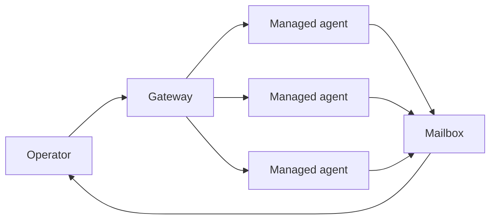
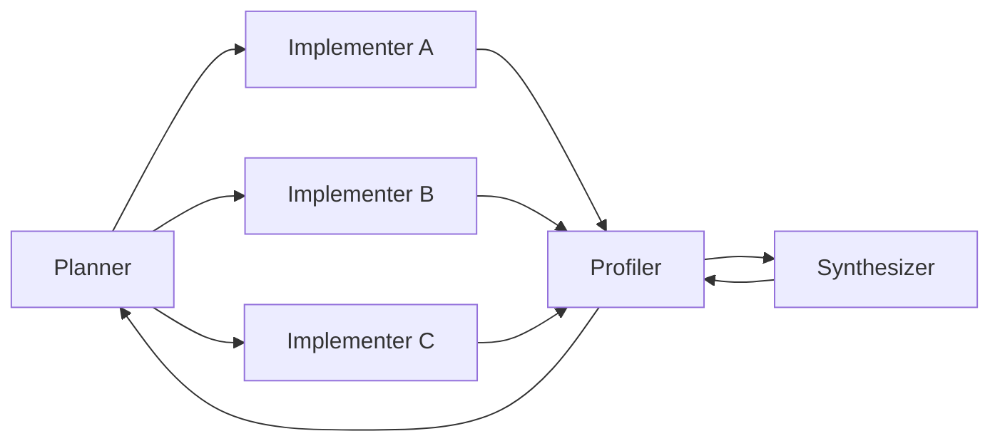

# Houmao System

Operator-supervised multi-agent work for long-running, evidence-heavy engineering tasks.

<div class="mt-5 text-sm">
  <a href="https://github.com/igamenovoer/houmao" target="_blank">https://github.com/igamenovoer/houmao</a>
</div>

<div class="pt-8 grid grid-cols-5 gap-8 items-center opacity-85">
  
  
  
  
  
</div>

---

# What Houmao Is

Houmao is a coordination system for running independent CLI agents as a managed team.

<div class="grid grid-cols-3 gap-4 mt-6 text-sm">
  <div class="border border-slate-300 rounded p-4 bg-slate-50">
    <div class="font-semibold text-slate-900 mb-2">Agent Runtime</div>
    <div>Launch, inspect, interrupt, and resume agents without collapsing every role into one chat.</div>
  </div>
  <div class="border border-slate-300 rounded p-4 bg-slate-50">
    <div class="font-semibold text-slate-900 mb-2">Communication Layer</div>
    <div>Route work through prompts, mailboxes, gateway events, and operator messages.</div>
  </div>
  <div class="border border-slate-300 rounded p-4 bg-slate-50">
    <div class="font-semibold text-slate-900 mb-2">Project Overlay</div>
    <div>Keep roles, skills, memories, workspaces, and loop state close to the repository.</div>
  </div>
</div>

---

# Target Use Cases

Houmao is for work that needs more than a single assistant turn.

| Task Shape | Why Houmao Helps |
| --- | --- |
| Long-running optimization loops | Agents keep state across rounds while the operator stays in control |
| Parallel exploration | Multiple implementers can test different hypotheses at the same time |
| Review-heavy engineering | Planner, coder, reviewer, and profiler roles keep context focused |
| Tool-diverse workflows | Agents can run different CLI tools, models, profiles, and workspaces |
| Interruptible operations | The operator can inspect liveness, redirect work, or stop a role |

---

# Design Philosophy

Houmao treats agents as supervised workers, not invisible background magic.

- **Explicit roles**: each agent has a name, prompt, workspace, tools, and boundaries.
- **Visible handoffs**: plans, results, and requests move through inspectable messages.
- **Operator authority**: humans can pause, redirect, inspect, and decide what counts as progress.
- **Local project memory**: reusable context lives near the repo instead of only inside a chat transcript.
- **Composable workflows**: simple messaging and launch primitives can support many loop shapes.

---

# Why Multiple Agents?

Multi-agent work pays off when context separation is more valuable than conversational simplicity.

| Pressure | Single Agent | Houmao Team |
| --- | --- | --- |
| Context | One conversation carries every detail | Roles keep focused context windows |
| Sampling | Self-review inherits the same blind spots | Review and synthesis come from separate agents |
| Evidence | Results mix with code edits | Benchmark and review output become explicit handoffs |
| Control | Hard to pause one part of the loop | Operator can inspect, interrupt, or redirect agents |

---

# Core Concepts



The gateway is the live control surface. Mailboxes carry asynchronous coordination. Skills package repeatable operations that agents can reuse.

---

# How You Use It

The common workflow is to define roles, launch agents, send work, inspect state, and collect results.

```bash
houmao-mgr project agents launch --profile planner
houmao-mgr project agents launch --profile implementer
houmao-mgr agents global list
houmao-mgr agents single planner prompt "Plan the next experiment"
```

In practice, teams wrap maintained `houmao-mgr` commands in project-local skills and launch profiles so repeatable loops stay boring.

---

# Control Surfaces

Houmao keeps coordination explicit instead of hiding it inside one long chat.

- **Launch profiles** define role, workspace, model/tool surface, and task boundaries.
- **Mailboxes** route plans, ready messages, benchmark results, review notes, and clarifying questions.
- **Gateway APIs** provide liveness checks, prompt delivery, runtime inspection, and reminders.
- **Skills** package workflows such as agent messaging, CUDA profiling, variant timing, and mailbox processing.

---

# Example: CUDA Kernel Optimization

CUDA optimization is the example in this repository, not the only Houmao use case.



One round means one hypothesis, several concrete variants, benchmark evidence, and a decision about what to keep.

---

# This Demo Package

This repository shows what that looks like in the MLSys 2026 FlashInfer contest setting.

| Surface | Role in the Example |
| --- | --- |
| `solution/` | Live CUDA or Triton submission bundle |
| `variants/` | Named kernel experiments managed by `project-cli` |
| `scripts/` | Pack, local benchmark, and Modal benchmark helpers |
| `docs/` and `context/` | Contracts, profiling notes, and working design context |
| `skillset/` | Project-local skills for CUDA optimization and runtime operations |

---

# Example Workflow

```bash
pixi run project-cli variant list
pixi run project-cli workload source list
pixi run project-cli variant deploy moe-base
pixi run bench
pixi run pack
```

The loop remains evidence-driven: choose a workload, make a kernel variant, deploy it, benchmark it, review the evidence, and keep the change only when it earns its place.

---

# Demo Page: Create Agents

<div class="h-[360px] border border-dashed border-slate-400 rounded flex items-center justify-center bg-slate-50 text-slate-500">
  Replacement visual slot
</div>

---

# Demo Page: Operator Control

<div class="h-[360px] border border-dashed border-slate-400 rounded flex items-center justify-center bg-slate-50 text-slate-500">
  Replacement visual slot
</div>

---

# Demo Page: Agent Loop

<div class="h-[360px] border border-dashed border-slate-400 rounded flex items-center justify-center bg-slate-50 text-slate-500">
  Replacement visual slot
</div>

---

# Guardrails

Houmao is useful because it makes boundaries concrete.

- Keep each role narrow enough that success and failure are easy to inspect.
- Keep generated artifacts, scratch output, and datasets out of the committed source tree.
- Keep GPU or dataset-dependent checks out of default unit tests.
- Use project-local specs and design notes when behavior or workflow conventions change.
- Treat benchmark evidence as the authority for CUDA optimization claims.

---

# Takeaway

Houmao is a system for keeping agent teams inspectable, interruptible, and useful over many turns.

CUDA kernel optimization is a demanding example: it needs planning, careful code edits, profiling, synthesis, and human judgment. The same design fits other engineering loops where the hard part is coordinating work without losing control.
