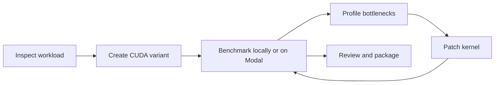

# MLSys 2026 FlashInfer Demo Package

Human-and-agent CUDA kernel optimization workflow for the FlashInfer AI Kernel Generation Contest.

<div class="pt-8 grid grid-cols-5 gap-8 items-center opacity-85">
  
  
  
  
  
</div>

---

# What This Fork Demonstrates

This repository starts from the FlashInfer Bench starter kit and adds project structure for Houmao-assisted optimization work.

| Surface | Role |
| --- | --- |
| `solution/` | Live CUDA or Triton submission bundle |
| `variants/` | Named kernel experiments managed by `project-cli` |
| `scripts/` | Pack, local benchmark, and Modal benchmark helpers |
| `docs/` and `context/` | Contracts, profiling notes, and working design context |
| `skillset/` | Project-local agent skills for CUDA optimization and runtime operations |

---

# Contest Task Shape

The demo focuses on contest-style kernels for modern LLM inference workloads.

- Target hardware: NVIDIA Blackwell.
- Local CUDA environment: CUDA 13.0 with `sm_100a` support.
- Evaluation path: FlashInfer Bench workloads, local GPU runs, or Modal B200 runs.
- Current CUDA entry point: `solution/cuda/kernel.cu::kernel`.
- Current solution style: TVM-FFI destination passing.

---

# Day-to-Day Workflow

```bash
pixi run project-cli variant list
pixi run project-cli workload source list
pixi run project-cli variant deploy moe-base
pixi run bench
pixi run pack
```

The core loop is simple: choose a workload, make a kernel variant, deploy it, benchmark it, review the evidence, and keep the change only when it earns its place.

---

# Where Agents Fit

Houmao-managed agents can work inside the same evidence loop as a human operator.



Agents can explore candidate kernels, run benchmark loops, summarize profiling evidence, and coordinate through review and submission checkpoints.

---

# Guardrails

The demo keeps contest submission behavior explicit.

- Keep generated `solution.json` out of source control.
- Keep dataset-dependent GPU checks out of default unit tests.
- Use OpenSpec when behavior, workflow, or project conventions change.
- Use CUDA Toolkit headers and vendored submission dependencies intentionally.
- Preserve the starter-kit shape expected by the contest evaluator.

---

# Takeaway

This package is a working optimization bench, not only a code template.

It gives humans and agents the same concrete loop: inspect the contract, edit the kernel, measure the result, explain the evidence, and package the best solution for FlashInfer Bench evaluation.
