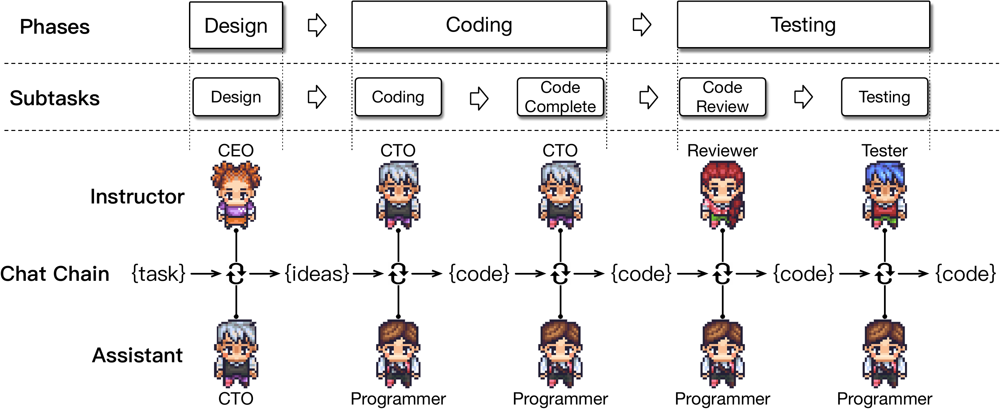
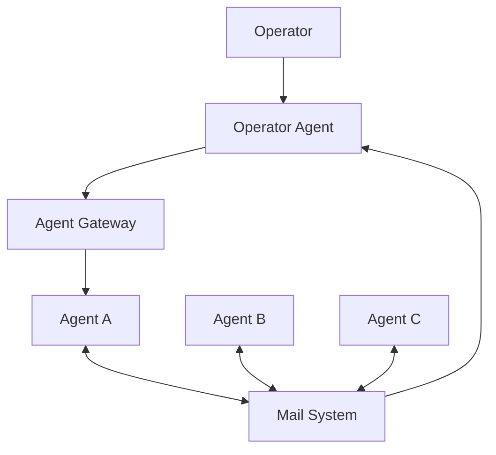
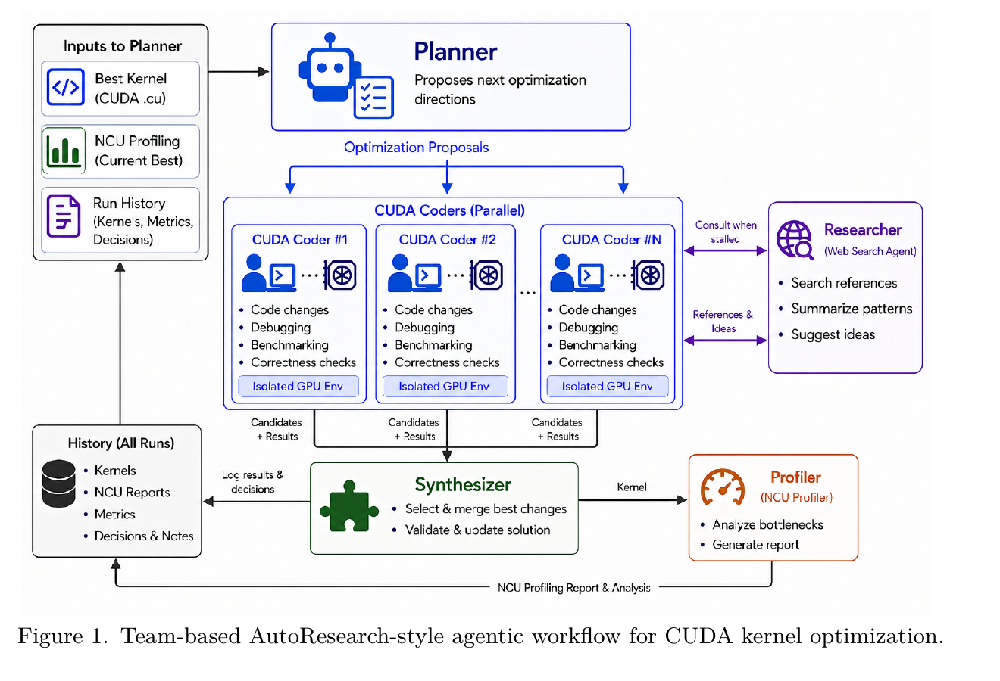

<h1 style="font-size: 2.35rem; line-height: 1.16; font-weight: 700;">
  Fast Prototyping Multi Aagent System 
  with Loosely Coupled CLI Agents
</h1>

Introduction to Houmao Agent Orchestration Framework

  Houmao（猴毛）:
  <a href="https://github.com/igamenovoer/houmao" target="_blank">https://github.com/igamenovoer/houmao</a>

---
layout: default
class: p-0
---

  <video
    src="../assets/lcsr-tmux-viewer-window-8x.mp4"
    class="h-full w-full object-contain"
    autoplay
    muted
    loop
    playsinline
    controls
  />

进一步控制 Agent Loop

  如果你需要对 agent loop 做更细粒度的控制，可以使用 <code>houmao-agent-loop-lite</code> 或 <code>houmao-agent-loop-pro</code> skills。

---
layout: default
---

# 为什么需要 Multi Agent System?

  
  
ChatDev chat chain：把 design、coding、testing 拆成 role-pair dialogues，并通过 artifact handoffs 串起来。

  <table class="mt-3 w-full text-[12px] leading-tight border-collapse">
    <thead>
      <tr class="border-b border-zinc-300 text-left">
        <th class="py-1 pr-2">Method</th>
        <th class="py-1 pr-2">Paradigm</th>
        <th class="py-1 pr-2 text-right">Complete</th>
        <th class="py-1 pr-2 text-right">Executable</th>
        <th class="py-1 pr-2 text-right">Consistent</th>
        <th class="py-1 text-right">Quality</th>
      </tr>
    </thead>
    <tbody>
      <tr class="border-b border-zinc-200">
        <td class="py-1 pr-2">GPT-Engineer</td>
        <td class="py-1 pr-2">single</td>
        <td class="py-1 pr-2 text-right">0.502</td>
        <td class="py-1 pr-2 text-right">0.358</td>
        <td class="py-1 pr-2 text-right">0.789</td>
        <td class="py-1 text-right">0.142</td>
      </tr>
      <tr class="border-b border-zinc-200">
        <td class="py-1 pr-2">MetaGPT</td>
        <td class="py-1 pr-2">multi</td>
        <td class="py-1 pr-2 text-right">0.483</td>
        <td class="py-1 pr-2 text-right">0.415</td>
        <td class="py-1 pr-2 text-right">0.760</td>
        <td class="py-1 text-right">0.152</td>
      </tr>
      <tr class="font-semibold">
        <td class="py-1 pr-2">ChatDev</td>
        <td class="py-1 pr-2">multi</td>
        <td class="py-1 pr-2 text-right">0.560</td>
        <td class="py-1 pr-2 text-right">0.880</td>
        <td class="py-1 pr-2 text-right">0.802</td>
        <td class="py-1 text-right">0.395</td>
      </tr>
    </tbody>
  </table>

  ChatDev 是一个有代表性的 multi-agent software engineering system，它把不同角色分工协作的软件开发过程组织成一条清晰的协作流程。

<table class="mt-4 w-full text-[15px] leading-snug border-collapse">
  <thead>
    <tr class="border-b border-zinc-300 text-left">
      <th class="py-2 pr-4">多智能体</th>
      <th class="py-2">单智能体</th>
    </tr>
  </thead>
  <tbody>
    <tr class="border-b border-zinc-200">
      <td class="py-2 pr-4">总 context 容量更大：每个智能体都有自己的 context 窗口</td>
      <td class="py-2">只有一个固定的 context 窗口</td>
    </tr>
    <tr class="border-b border-zinc-200">
      <td class="py-2 pr-4">context 更干净：设计、编码、评审彼此分离</td>
      <td class="py-2">所有信息都挤在同一段对话里</td>
    </tr>
    <tr class="border-b border-zinc-200">
      <td class="py-2 pr-4">提示词更聚焦：每个智能体只负责一个目标</td>
      <td class="py-2">一个提示词里混杂多个目标</td>
    </tr>
    <tr class="border-b border-zinc-200">
      <td class="py-2 pr-4">采样更独立：评审者不是作者本人</td>
      <td class="py-2">自检会继承同样的盲点</td>
    </tr>
  </tbody>
</table>

来源：Qian et al., <em>ChatDev</em>, arXiv:2307.07924.

---

# 方案一：代码驱动框架

  

    
PlannerAgent class

    
OpenAI API

  

  

    
CoderAgent class

    
Claude API

  

  

    
ReviewerAgent class

    
OpenAI API

  

  

    
TestAgent class

    
Claude API

  

  

    
Orchestrator class

  

  
plan

  
code

  
review

  
test

优点

- **控制更精细**：流程怎么走、状态怎么切换，都是明确写出来的
- **更容易验证**：路由、检查点、运行轨迹都在代码里
- **更适合正式落地**：天然贴近产品化和后台部署场景

缺点

- **工程负担更重**：编排系统本身要设计、测试、维护，硬编码流程也得预先覆盖各种异常情况
- **用户难以实时介入**：除非专门设计交互界面，否则过程通常不可交互
- **迭代更困难**：系统一旦要调整，往往就得重启流程或重写程序，工程工作很多

---

# 方案二：CLI 原生工具

  

    
Subagents

    
Main Claude session

    
Explore subagent

    
Review subagent

    
Debug subagent

    
delegate

    
summary

    

    

    

    

  

  

    
Agent team

    
Team lead

    

      
Shared task list

      

      
Mailbox / messages

    

    
Teammate A

    
Teammate B

    
Teammate C

    

    
tasks + mail

    

    

    

  

优点

- **上手最快**：几乎不用额外搭系统，启动成本最低
- **文档和生态更齐全**：官方说明、使用资料和周边支持通常更完整
- **原生体验更强**：整体使用感受更像产品自带的一部分

缺点

- **可控性受产品限制**：可能因厂商限制而过早终止，消息格式、处理优先级和恢复机制也未必能定制
- **平台绑定更强**：通常不支持跨平台通信，不同家的 agent 很难直接协作
- **隔离性受限**：不能让不同 agent 分别使用不同第三方模型、用户权限、Docker 环境或项目

---

# 方案三：Houmao（猴毛）

  

    Operator
    human / script / agent
  

  

  

  

  

  

  

    
Agent gateway

    

    
claude · tmuxisolated runtime home

  

  

    
Agent gateway

    

    
codex · tmuxisolated runtime home

  

  

    
Agent gateway

    

    
gemini · tmuxisolated runtime home

  

  

  

  

  

  

  

    Shared mailbox
    durable inter-agent messages
  

computer use for TUI coding agent

优点

- **实时观测和交互**：每个 agent 都是可直接查看、可直接介入的真实 CLI 进程
- **快速迭代，深度定制**：无代码，运行过程中也能直接调整提示词、agent 间通信、skills 和任务安排
- **运行环境更灵活**：工具、模型、技能、项目、容器和主机都可以不同

缺点

- **agent 行为不确定**：相比硬编码流程，prompt 和 skill 驱动的 agent 行为每次运行都可能不同
- **可靠性不足**：依赖自定义逻辑解析 TUI 信息，不如硬编码或内部 API 调用稳定
- **学习门槛更高**：第一次真正跑起来之前，要先理解更多概念

---

# 要不要用 Houmao？

不要把事情搞复杂

- 如果单个 agent、subagent，或者工具原生的 agent team 已经够用，就先用它们。
- 只有当这些一线工具明显开始成为瓶颈时，再考虑切到 Houmao。

什么时候考虑 Houmao

- **最大化可观测性和交互能力**：你希望尽可能实时看到 agent 在做什么，并且随时介入调整
- **隔离的 agent 运行环境**：你希望混用不同平台的 agent，并给它们配置不同的工具、模型、思考强度、MCP server、skills、记忆、worktree、容器或主机
- **完整控制通信机制**：你希望自己决定 prompt 怎么路由、消息怎么发、队列怎么排、哪些消息要丢弃、路由规则怎么写，以及归档如何处理
- **组织结构可动态调整**：你希望随着系统运行，持续修改 skills、角色、目标、协议、路由方式或完成条件
- **自定义容错能力**：你希望在 API 报错、网络中断、进程被杀、机器重启或状态部分损坏后，仍然能自己控制恢复过程

---

# 推荐使用场景

这些场景里，Houmao 额外带来的复杂度通常是值得的。

  <table class="w-full text-[15px] leading-snug border-collapse">
    <thead>
      <tr class="text-left" style="background: linear-gradient(90deg, #dbeafe 0%, #eff6ff 100%);">
        <th class="px-4 py-3" style="width: 50%; border-right: 1px solid #cbd5e1; color: #172554; font-weight: 700;">场景</th>
        <th class="px-4 py-3" style="color: #172554; font-weight: 700;">为什么适合 Houmao</th>
      </tr>
    </thead>
    <tbody>
      <tr style="background: rgba(255,255,255,0.95);">
        <td class="px-4 py-3 align-top" style="border-top: 1px solid #e2e8f0; border-right: 1px solid #e2e8f0;">复现一篇没有官方源码的 multi-agent 论文</td>
        <td class="px-4 py-3 align-top" style="border-top: 1px solid #e2e8f0;">支持深度定制 agent 行为，同时复用 CLI 已有能力，让你把精力放在行为设计上，而不是先实现一整套可靠 agent 系统</td>
      </tr>
      <tr style="background: rgba(248,250,252,0.92);">
        <td class="px-4 py-3 align-top" style="border-top: 1px solid #e2e8f0; border-right: 1px solid #e2e8f0;">在一天内快速做出一个 multi-agent system 原型</td>
        <td class="px-4 py-3 align-top" style="border-top: 1px solid #e2e8f0;">支持实时调整 agent 行为，也不用一开始就把所有行为细节都想清楚</td>
      </tr>
      <tr style="background: rgba(255,255,255,0.95);">
        <td class="px-4 py-3 align-top" style="border-top: 1px solid #e2e8f0; border-right: 1px solid #e2e8f0;">用 OpenClaw / Hermes 驱动 Claude + Codex 开发团队</td>
        <td class="px-4 py-3 align-top" style="border-top: 1px solid #e2e8f0;">提供通信机制和 agent 生命周期管理，并且本身就是按“由其他 agent 驱动”来设计的</td>
      </tr>
      <tr style="background: rgba(248,250,252,0.92);">
        <td class="px-4 py-3 align-top" style="border-top: 1px solid #e2e8f0; border-right: 1px solid #e2e8f0;">在不稳定的运行环境里工作</td>
        <td class="px-4 py-3 align-top" style="border-top: 1px solid #e2e8f0;">agent 是独立进程，一个挂掉不会拖垮其他 agent；同时也能通过 mailbox 里的消息记录恢复工作</td>
      </tr>
    </tbody>
  </table>

共性是：你需要操作并深度定制这个 agent system，而不是只关心它的输出。

---

# 不适合的场景

如果你并不需要 Houmao 这种操作层控制能力，那就先用更轻量、或者更产品化的工具。

  <table class="w-full text-[15px] leading-snug border-collapse">
    <thead>
      <tr class="text-left" style="background: linear-gradient(90deg, #fee2e2 0%, #fef2f2 100%);">
        <th class="px-4 py-3" style="width: 50%; border-right: 1px solid #cbd5e1; color: #7f1d1d; font-weight: 700;">场景</th>
        <th class="px-4 py-3" style="color: #7f1d1d; font-weight: 700;">更合适的第一选择</th>
      </tr>
    </thead>
    <tbody>
      <tr style="background: rgba(255,255,255,0.95);">
        <td class="px-4 py-3 align-top" style="border-top: 1px solid #e2e8f0; border-right: 1px solid #e2e8f0;">想做一个要稳定跑 10,000 小时的生产级 multi-agent 服务</td>
        <td class="px-4 py-3 align-top" style="border-top: 1px solid #e2e8f0;">代码驱动框架，更适合做部署、测试、监控和 SLA 保障</td>
      </tr>
      <tr style="background: rgba(248,250,252,0.92);">
        <td class="px-4 py-3 align-top" style="border-top: 1px solid #e2e8f0; border-right: 1px solid #e2e8f0;">只是想并行处理一次性任务，比如分头搜索网页</td>
        <td class="px-4 py-3 align-top" style="border-top: 1px solid #e2e8f0;">当前 CLI 产品内置的 subagents</td>
      </tr>
      <tr style="background: rgba(255,255,255,0.95);">
        <td class="px-4 py-3 align-top" style="border-top: 1px solid #e2e8f0; border-right: 1px solid #e2e8f0;">只想让 Codex 一次性调用 Claude，或反过来</td>
        <td class="px-4 py-3 align-top" style="border-top: 1px solid #e2e8f0;">skills 和 headless calls，比如 <code>claude -p &lt;prompt&gt;</code></td>
      </tr>
      <tr style="background: rgba(248,250,252,0.92);">
        <td class="px-4 py-3 align-top" style="border-top: 1px solid #e2e8f0; border-right: 1px solid #e2e8f0;">想快速试一个 agent loop，而且只关心最终结果</td>
        <td class="px-4 py-3 align-top" style="border-top: 1px solid #e2e8f0;">工具原生的 agent teams</td>
      </tr>
    </tbody>
  </table>

共性是：你要的是结果，或者生产服务，而不是一个可观测、可操作的 agent 运行环境。

---
layout: section
---

# Houmao 核心概念

从角色定义、运行实例，到通信与协作控制。

---

# Agent 核心概念

Houmao 如何定义和启动 agent。

  

    
Specialist

    
<strong>定义</strong>：某类 agent 的可复用角色包。

    
<strong>动机</strong>：不用反复重写同一套角色 prompt、skills、默认配置和 memo seed。

    
<strong>可以放</strong>：角色 prompt、预安装 skills、CLI tool 配置、默认 memo 内容。

  

  

    
Launch Profile

    
<strong>定义</strong>：记录启动时参数的记录，用来给 specialist 一个运行时身份。

    
<strong>动机</strong>：把同一个 specialist 每次启动时要重复填写的运行参数保存下来，让它以明确身份进入运行态。

    
<strong>可以放</strong>：agent name、workdir、mailbox posture、additional system prompt and memo。

  

  

    
Agent Instance

    
<strong>定义</strong>：正在运行的 agent 实例，由 specialist 或 launch profile 创建出来的受 Houmao 管理的 CLI 进程。

    
<strong>来源</strong>：由 launch profile 启动后产生。

    
<strong>运行时状态</strong>：CLI 进程、tmux session、runtime home、registry/manifest、mailbox binding、gateway state。

  

  

    类似 class，定义可复用的 agent 模板。
  

  

    类似 constructor params，记录启动时参数。
  

  

    类似 object instance，是启动后的运行实体。
  

---

# Multi-Agent 协作

Houmao 同时支持 agent 之间的协作，以及 operator 与 agent team 之间的协作。

Agent 之间

- 通过 mail system 交换有边界的请求和回复
- 每个 agent 保持自己的 context、tools 和 workspace
- 共享状态放在 messages 和 artifacts 里，而不是一个共享聊天窗口里

Operator 与 agents

- operator 可以通过 gateway 直接 prompt、interrupt、inspect 或 recover
- operator 也可以通过 mail 查看协作状态、发送任务、归档结果
- 最终哪些输出进入 accepted work，仍然由 operator 决定

---
layout: section
---

# Agent Loop Pro Authoring

从 intention source 生成可验证、可执行的 execplan package。

---

# 为什么 Agent Loop 能工作？

Agent Loop Pro 不是生成一个“总控大脑”，而是生成一组松耦合的运行约束：事件如何定义、agent 遇到事件时怎么做、状态如何可靠读写、协作记录放在哪里。

  

    
1. on-event skill 定义行为

    
mail schema 定义“发生了什么事件”；对应的 on-event skill 像 callback functions，规定 agent 收到这类 mail 后应该读什么、做什么、回什么。

  

  

    
2. houmao-memo.md 提供轻量记忆

    
memo 记录任务相关细节、临时策略和 operator 给出的行为指令。它不是长期知识库，而是当前任务里让 agent 不忘关键上下文的轻量 memory。

  

  

    
3. harness 负责可靠读写

    
agent 不直接猜状态文件怎么改，而是通过 harness 做 validate、query、render、apply、control。这样状态更新和 schema 校验有统一入口。

  

  

    
4. mailbox 是主通信通道

    
mailbox 可以表达点对点、广播、汇总、转发、等待回复等通信模式；同时它也是任务记录的最后兜底，保留谁在什么时候交付了什么。

  

  <code>mail schema</code> 定义事件，<code>on-event skill</code> 定义响应，<code>houmao-memo.md</code> 保持局部记忆，<code>harness</code> 保证读写可靠，<code>mailbox</code> 串起协作和记录。

---

# Authoring 产物总览

Agent Loop Pro authoring 的核心产物，是把可编辑意图逐步转成可校验、可启动的 loop package。

  

    
<code>intention/</code>

    
operator 可编辑的意图来源：记录目标、项目背景、参与者、协作流程、通信方式、状态、workspace 和约束。

  

  

    
<code>execplan/specs/collab/</code>

    
协作过程的权威说明：描述拓扑、生命周期、交接方式、mail 路由和控制姿态。

  

  

    
<code>execplan/specs/**</code>

    
可验证的约束层：定义目标、参与者、通信 schema/renderers、状态表、workspace 策略和运行产物。

  

  

    
<code>execplan/harness/</code>

    
这个 loop 自带的命令入口：提供 validate、query、render、apply、control，让 agents 统一读写状态。

  

  

    
<code>execplan/skills/</code>

    
生成的 skills：把事件处理、角色 tick 和 operator 控制写成 agents 可加载的操作步骤。

  

  

    
<code>execplan/agents/</code>

    
agent 绑定层：把 participant 映射到具体 agent id、profile、notifier prompt、memo seed、skills 和 workspace 策略。

  

  

    
<code>execplan/docs/</code> + <code>manifest.toml</code>

    
给读者和 operator 的索引：说明 package 包含什么、如何运行、运行模型是什么、哪些 artifact 是权威来源。

  

  

    
<code>execplan/adrs/</code> + 校验结果

    
决策记录和一致性检查：记录关键取舍，并验证 specs、harness、skills、agents 是否相互匹配。

  

---

# `init`

- **定位**：为一个新 agent loop 创建可编辑的 source 区域。
- **输入**：loop 目录、operator 的初始目标、可选 project context。
- **边界**：只初始化 intention source，不生成 `execplan/`，也不启动 agent。

输出文件

| 文件 | 作用 |
| --- | --- |
| `intention/loop-overview.md` | 只是 skeleton：预留目标、参与者、协作流程、handoff、open questions 等字段 |
| `intention/project-context.md` | 当前项目的背景事实：repo 结构、可用命令、约束、已有约定和 workspace 假设 |

---

# Example: init

  

    
You

    
$houmao-agent-loop-pro init teams/lead-code-synth-research

  

  

    
AI

    
Initialized intention source.  Created: - intention/README.md - intention/loop-overview.md - intention/project-context.md  No execplan/ or adrs/ generated.

  

---

# `create-intention`

- **定位**：创建最小 intention source，用来承载 loop 的初始意图。
- **输入**：loop 目录、operator 对目标和参与者的描述。
- **边界**：不做 project context 探测，也不进入 execplan 生成阶段。
- **输出**：`intention/loop-overview.md`，最小 intention source。

`loop-overview.md` key sections

| 分组 | 目的 |
| --- | --- |
| goal boundary | 说明这个 loop 想完成什么，以及当前还不处理什么 |
| participants | 记录预期参与者、责任分工，以及哪些角色还需要澄清 |
| workflow sketch | 勾勒初始协作流程、handoff 和 open questions，供后续 clarify/execplan 使用 |

---

# Example: create-intention

  

    

      
You

      
read the paper teams/lead-code-synth-research/source/mlsys26-tech-report.pdf, we want to implement such a multi agent system

    

    

      
AI

      
Created loop intent from the paper.  Updated loop-overview.md. Added focused intent files: - paper-notes.md - participants.md - workflow.md - constraints.md  No execplan/ generated.

    

  

  

    
PDF Snapshot: Agent Structure

    
  

---

# `clarify-intent`

- **定位**：在生成 execplan 前，补齐 intention 中影响设计的关键问题。
- **输入**：`intention/` 下的目标、参与者、协作方式和约束。
- **边界**：只澄清 source intent，不直接写运行时 contract。

更新文件组

| 文件组 | 作用 |
| --- | --- |
| `<loop-dir>/adrs/*.md` | 记录已接受的 intent decision：问了什么、为什么重要、最终怎么决定 |
| `intention/loop-overview.md` | 更新目标、参与者、生命周期、拓扑和整体操作模型 |
| `intention/*.md` | 按主题补充 `participants.md`、`workflow.md`、`communication.md`、`state.md`、`workspace.md`、`constraints.md` 等 source docs |

---

# Example: clarify-intent

  

    
You

    
$houmao-agent-loop-pro clarify intent

  

  

    
AI

    

      
Question 1: First Scope

      
Which implementation scope should this Houmao loop target first?

      <table class="tmux-table">
        <thead>
          <tr>
            <th class="tmux-col-narrow">Option</th>
            <th class="tmux-col-wide">Scope</th>
          </tr>
        </thead>
        <tbody>
          <tr>
            <td>A</td>
            <td>Recommended: Active Fused MoE only for the first implementation.</td>
          </tr>
          <tr>
            <td>B</td>
            <td>Build a reusable framework, but run the first concrete cycle on Fused MoE.</td>
          </tr>
          <tr>
            <td>C</td>
            <td>Support Fused MoE, DSA TopK, and DSA Sparse Attention from day one.</td>
          </tr>
        </tbody>
      </table>
      
Reply with A, recommended, yes, or a short alternative.

    

  

---

# `execplan-specs-process`

- **定位**：先定义协作过程，作为后续 artifact 的 process authority。
- **输入**：intention 中的目标、参与者、事件、handoff 和 recovery 设想。
- **边界**：关注 phase、event、tick、handoff 和伪代码，不生成具体 agent 绑定。
- **输出**：`execplan/specs/collab/collab-overview.md`，第一个 generated authority。

`collab-overview.md` key sections

| 分组 | 目的 |
| --- | --- |
| scope boundary | 说明这个 loop 解决什么问题、暂时不解决什么问题，避免后续 artifact 偷偷扩大范围 |
| topology model | 说明参与者之间是什么协作形状，谁拥有哪类工作，以及运行时按什么模式推进 |
| event flow | 说明一次工作如何从触发开始，经过哪些阶段、交接和分支，最后到达下一步状态 |
| mail routing | 说明消息如何成为事件、结果应该发给谁，以及哪些 mail family 会变成具体 contract |
| runtime control | 说明 agent 每次被唤醒该做什么，以及 operator 如何暂停、恢复、修复或结束 run |
| derivation aids | 用伪代码、时序图和未决问题，把抽象流程变成后续 contract 可以派生的依据 |

---

# Example: execplan-specs-process

  

    

      
You

      
execplan-specs-process

    

    

      
AI

      
Generated process-stage files:  - execplan/specs/README.md - execplan/specs/collab/README.md - execplan/specs/collab/collab-overview.md  Next step: execplan-specs-contract

    

  

  

    
collab-overview.md preview

    

      <h3>Generated Process Overview</h3>
      
<strong>Selected topology mode:</strong> <code>generic-loop</code>.

      
The loop is a directed graph with parallel Coder branches and repeated planning cycles. Normal work moves from Planner to two CUDA Coders, then to Synthesizer, then to Evaluator, then back to Planner through evaluation evidence.

      
<strong>Normal directed routes:</strong>

      <ul>
        <li>Human Operator to Planner: start, stop, pause, resume, redirect, invalidate, or force a new cycle.</li>
        <li>Planner to CUDA Coder 1 and CUDA Coder 2: optimization assignments with distinct directions.</li>
        <li>CUDA Coders to Synthesizer: routine <code>coder-result</code> mail containing candidate evidence.</li>
      </ul>
    

  

---

# `execplan-specs-contract`

- **定位**：从 process spec 派生可验证的 contract 集合。
- **输入**：`collab-overview.md` 和 intention 中的约束。
- **边界**：定义结构和约束，不生成执行脚本和 skills。

contract 文件组

| 文件组 | 作用 |
| --- | --- |
| `specs/objective/`、`specs/participants/` | 定义成功标准、policy、participant role templates 和 stable role instances |
| `specs/collab/topology/` | 定义 `tree-loop` 或 `generic-loop`、route graph、cycle posture、context posture |
| `specs/comms/` | 定义 mail templates、`schema_id`、JSON schemas、Markdown renderers 和 reply expectation |
| `specs/state/`、`specs/workspace/`、`specs/run/` | 定义 bookkeeping state、workspace policy、run artifacts 和结构化记录 schema |

---

# Example: execplan-specs-contract

  

    

      
You

      
execplan-specs-contract

    

    

      
AI

      
Generated contract layer:  - objective/ - participants/ - collab/topology/ - comms/ - state/ - workspace/ - run/  Validated TOML, JSON and SQL.

    

  

  

    
Generated Contract Tree

    <pre class="loop-example-code loop-example-tree">execplan/specs/
|-- objective/       objective.toml, policy.toml
|-- participants/   participants.toml, role *.md
|-- collab/
|   |-- loop-policy.toml
|   `-- topology/   topology.toml, graph.md, context-posture.toml
|-- comms/
|   |-- templates.toml
|   |-- schemas/*.schema.json
|   `-- renderers/*.md.j2
|-- state/          schema.sql, invariants.toml, seed.toml
|-- workspace/      workspace.toml
`-- run/            control.toml, run-artifacts.toml</pre>
  

---

# `execplan-harness`

- **定位**：生成 loop package 自带的验证、查询、渲染、应用和控制入口。
- **输入**：process spec 和 contracts。
- **边界**：harness 服务于这个 loop，不替代 Houmao 平台级 lifecycle 命令。

harness 文件组

| 文件组 | 作用 |
| --- | --- |
| `execplan/harness/commands.toml` | loop-local command registry：列出 validation、query、render、apply、control 等命令 |
| `execplan/harness/src/`、`bin/` | command implementation 和 wrapper，给 agents 或 operator 调用 |
| `execplan/harness/schemas/`、`refs/` | command envelope schema，以及指向 authoritative package artifacts 的相对引用 |
| `dependency-posture.toml`、`requirements.txt`、`vendor/` | 只在需要非标准库或 standalone/custom execution 时记录依赖姿态 |

---

# Example: execplan-harness

  

    

      
You

      
execplan-harness

    

    

      
AI

      
Generated harness stage:  - commands.toml - bin/lead-code-synth-research-harness - src/..._harness.py - command-envelope.schema.json - dependency-posture.toml  Smoke tests passed.

    

  

  

    
Generated Harness CLI

    
lead-code-synth-research-harness |-- self-check |-- topology&nbsp;&nbsp; validate / query |-- context&nbsp;&nbsp;&nbsp; validate / query |-- email&nbsp;&nbsp;&nbsp;&nbsp;&nbsp; schema / validate / render / apply / query |-- state&nbsp;&nbsp;&nbsp;&nbsp;&nbsp; init / validate / query / export |-- record&nbsp;&nbsp;&nbsp;&nbsp; validate / apply `-- control&nbsp;&nbsp; status / get-mode / set-mode / pause / resume / stop  核心能力： - 校验 topology、context、state 和 mail payload - 渲染 mail，并把 lifecycle facts 写入 sqlite state - 给 agents 提供统一 query/control 入口

  

---

# `execplan-skills`

- **定位**：把 loop 行为编译成 agents 可以安装和调用的 generated skills。
- **输入**：process spec、contracts、事件定义和 operator control 需求。
- **边界**：每个 skill 都应该是 bounded turn，不依赖长期 in-chat wait。

skills 文件组

| 文件组 | 作用 |
| --- | --- |
| `<loop-slug>-shared-harness/SKILL.md` | 统一说明 agents 如何使用 generated harness、contracts 和 structured outputs |
| `<loop-slug>-<role>-on-<message-family>/SKILL.md` | 处理一个具体 `schema_id` 或 event family，做一个 bounded action 后结束 |
| `<loop-slug>-<role>-tick/`、`<loop-slug>-operator-control/` | 调度/恢复/完成检查，以及 operator 的 status、pause、resume、stop、manual step 等控制 |

---

# Example: execplan-skills

  

    
You

    
go next

  

  

    
AI

    
Routed to execplan-skills.  Generated 16 flat skill dirs: - shared harness usage - 9 on-event handlers - 5 role tick handlers - operator control  Next step: execplan-agent-bindings

  

  <h3>Generated Skills Preview</h3>
  <table class="generated-skills-table">
    <thead>
      <tr>
        <th>Skill</th>
        <th>Purpose</th>
      </tr>
    </thead>
    <tbody>
      <tr><td><code>shared-harness</code></td><td>让所有角色用同一个 harness 查询 control status、schema 和 state。</td></tr>
      <tr><td><code>on-planning-cycle-start</code></td><td>Planner 打开一个 cycle，并发出两个 Coder assignment。</td></tr>
      <tr><td><code>on-optimization-assignment</code></td><td>Coder 执行一次 bounded implementation attempt，然后发送结果或 blocker。</td></tr>
      <tr><td><code>on-coder-result</code></td><td>Synthesizer 汇总 Coder evidence，决定是否产出 synthesis-report。</td></tr>
      <tr><td><code>on-evaluation-report</code></td><td>Planner 只根据 Evaluator accepted evidence 更新 current-best。</td></tr>
    </tbody>
  </table>

---

# `execplan-agent-bindings`

- **定位**：把 participant contract 绑定到可启动的 Houmao agent 配置。
- **输入**：participants、workspace contract、generated skills 和 notifier prompt 需求。
- **边界**：只生成绑定材料，不启动 live agent。

agent binding 文件组

| 文件组 | 作用 |
| --- | --- |
| `execplan/agents/bindings.toml` | 把 participant instance 映射到 concrete agent id、skills、prompt source、workspace policy 和 notifier prompt |
| `execplan/agents/profiles/<agent-id>/config.toml` | 记录准备 Houmao profile 时需要的 concrete agent 配置意图 |
| `execplan/agents/profiles/<agent-id>/definition.md`、`memo-seed.md` | agent 的 role prompt source 和可选 memo seed |
| `execplan/agents/notifier-prompts/<agent-id>.md` | mail-driven participant 被 notifier 唤醒后，如何按 `schema_id` 选择 generated skill |

---

# Example: execplan-agent-bindings

  

    

      
You

      
next

    

    

      
AI

      
Generated agent bindings:  - agents/bindings.toml - six planned profile configs - role definitions - memo seeds - notifier prompts  No live agents were launched.

    

  

  

    <h3>Binding Result</h3>
    <table class="generated-skills-table">
      <thead>
        <tr>
          <th>Participant</th>
          <th>Agent / CLI</th>
        </tr>
      </thead>
      <tbody>
        <tr><td><code>planner</code></td><td><code>lcsr-planner</code> → Claude</td></tr>
        <tr><td><code>cuda-coder-1</code></td><td><code>lcsr-cuda-coder-1</code> → Codex</td></tr>
        <tr><td><code>cuda-coder-2</code></td><td><code>lcsr-cuda-coder-2</code> → Codex</td></tr>
        <tr><td><code>synthesizer</code></td><td><code>lcsr-synthesizer</code> → Codex</td></tr>
        <tr><td><code>researcher</code></td><td><code>lcsr-researcher</code> → Codex</td></tr>
        <tr><td><code>evaluator</code></td><td><code>lcsr-evaluator</code> → Claude</td></tr>
      </tbody>
    </table>
    
每一条 mapping 同时指向 profile config、definition、memo seed、notifier prompt 和 assigned skills。

  

---

# `execplan-finalize`

- **定位**：整理 execplan package，让它可以被阅读、校验和执行。
- **输入**：已经生成的 specs、harness、skills 和 agent bindings。
- **边界**：docs 解释 package，但 source authority 仍然是 specs 和 contracts。

final package 文件组

| 文件组 | 作用 |
| --- | --- |
| `execplan/manifest.toml` | final artifact index：路径、artifact kind、plan revision、generated-source posture、omissions |
| `execplan/docs/artifact-index.md` | 给人快速查 package 里有什么，每个 artifact 去哪里读 |
| `operator-guide.md`、`runtime-model.md`、`validation.md` | 总结如何操作、runtime 如何被 notifier/mail/skills 驱动、validation posture 是什么 |

---

# Example: execplan-finalize

  

    
You

    
finalize execplan

  

  

    
AI

    
Generated final support layer:  - manifest.toml - docs/artifact-index.md - docs/operator-guide.md - docs/runtime-model.md - docs/validation.md  Package is ready for validation.

  

---

# `validate-execplan`

- **定位**：检查 execplan package 的结构、引用和 artifact 一致性。
- **输入**：完整或部分生成的 `execplan/`。
- **边界**：验证 package shape，不证明 live runtime 已经准备好。

检查对象

| 文件组 | 检查什么 |
| --- | --- |
| `manifest.toml` | package 是否可索引、路径是否存在、omission 是否被记录 |
| `execplan/specs/**` | process authority、contracts、topology、comms、state、workspace、run 是否一致 |
| `harness/**`、`skills/**`、`agents/**` | command registry、generated skills、agent bindings 是否符合约定且互相引用正确 |
| validation report | 报告缺失文件、parse/link failures、stale markers 和是否可进入 execution preparation |

---

# Example: validate-execplan

  

    
You

    
validate execplan

  

  

    
AI

    

      
Validation summary

      <table class="tmux-table">
        <thead>
          <tr>
            <th class="tmux-col-medium">Check</th>
            <th class="tmux-col-wide">Result</th>
          </tr>
        </thead>
        <tbody>
          <tr>
            <td>manifest paths</td>
            <td>ok</td>
          </tr>
          <tr>
            <td>TOML / JSON / SQL</td>
            <td>ok</td>
          </tr>
          <tr>
            <td>harness self-check</td>
            <td>ok</td>
          </tr>
          <tr>
            <td>binding/profile consistency</td>
            <td>ok</td>
          </tr>
          <tr>
            <td>live profile readiness</td>
            <td>missing credentials/profiles</td>
          </tr>
        </tbody>
      </table>
      
Next: clarify CLI credentials, then prepare-agents.

    

  

---

# `clarify-execplan`

- **定位**：在 execplan 已生成后，处理 implementation-level 的歧义。
- **输入**：现有 `execplan/`、validation 结果和 operator 的修正意图。
- **边界**：只改 execplan 层的歧义，不重新定义原始目标，除非同步回 intention。

可能更新的文件组

| 文件组 | 作用 |
| --- | --- |
| `execplan/adrs/*.md` | 记录 accepted execplan implementation decisions，以及影响哪些 generated artifacts |
| `execplan/specs/**`、`harness/**`、`skills/**`、`agents/**` | 修正 contracts、commands、skill trigger/procedure、agent binding 或 notifier prompt |
| stale-artifact notes | 标出受影响的下游 artifacts：哪些已更新，哪些需要 regeneration 或已经 stale |

---

# Example: clarify-execplan

  

    
You

    
clarify the workspace execplan

  

  

    
AI

    

      
Question: Workspace Materialization

      <table class="tmux-table">
        <thead>
          <tr>
            <th class="tmux-col-narrow">Option</th>
            <th class="tmux-col-wide">Decision</th>
          </tr>
        </thead>
        <tbody>
          <tr>
            <td>A</td>
            <td>Recommended: in-repo Git worktrees, one private repo/ per <code>lcsr-*</code> agent.</td>
          </tr>
          <tr>
            <td>B</td>
            <td>Shared repo with per-agent states only.</td>
          </tr>
          <tr>
            <td>C</td>
            <td>External workspaces outside the repo.</td>
          </tr>
        </tbody>
      </table>
      
After answer: record execplan ADR, update workspace contract and final docs.

    

  

---

# `update-execplan`

- **定位**：当 intention 或 contract 变化时，从最早受影响阶段向后刷新。
- **输入**：变更后的 source material，以及要保留或重生成的 artifact 范围。
- **边界**：避免盲目全量重写，重点是保持 artifact dependency 一致。

按影响范围刷新

| 最早受影响文件组 | 后续动作 |
| --- | --- |
| `execplan/specs/collab/collab-overview.md` | process 变了，重跑 contracts、harness、skills、bindings、finalize |
| `execplan/specs/**` contracts | contracts 变了，重跑 harness、skills、bindings、finalize |
| `execplan/harness/**` 或 `execplan/skills/**` | 命令或 agent procedure 变了，重跑下游 skills/bindings/docs |
| `execplan/agents/**`、`docs/**`、`manifest.toml` | 只刷新 concrete bindings 或 final package material，并最后 `validate-execplan` |

---

# Example: update-execplan

  

    
You

    
$houmao-agent-loop-pro update-execplan teams/lead-code-synth-research  intention/workspace.md changed: use in-repo worktrees.

  

  

    
AI

    

      
Impact plan

      <table class="tmux-table tmux-impact-table">
        <thead>
          <tr>
            <th class="tmux-col-medium">Changed area</th>
            <th class="tmux-col-medium">Earliest stage</th>
            <th class="tmux-col-wide">Refresh</th>
          </tr>
        </thead>
        <tbody>
          <tr>
            <td>intention/workspace.md</td>
            <td>execplan-specs-contract</td>
            <td>workspace, harness refs, skills, bindings, docs</td>
          </tr>
          <tr>
            <td>collab-overview.md</td>
            <td>execplan-specs-process</td>
            <td>all downstream artifacts</td>
          </tr>
          <tr>
            <td>agents/bindings.toml</td>
            <td>execplan-agent-bindings</td>
            <td>profiles, notifier prompts, final docs</td>
          </tr>
        </tbody>
      </table>
      
Run validate-execplan last.

    

  

Recording 中没有单独的 <code>update-execplan</code> run；这个 slide 展示同类 refresh 逻辑。相关 workspace clarification snapshots: <code>s008400</code> → <code>s008560</code>。

---
layout: section
---

# Agent Loop Pro Execution

从 execplan package 准备、启动、运行和恢复 live Houmao agents。

---

# `prepare-agents`

- **定位**：把 generated agent material 转成可启动的 Houmao agent 准备状态。
- **输入**：`execplan/agents/`、generated skills、notifier prompts 和 memo seeds。
- **输出**：specialists、launch profiles、已安装 skills 和准备报告。
- **边界**：只准备 agent 材料，不启动 CLI 进程。

  

    
You

    
$houmao-agent-loop-pro prepare-agents teams/lead-code-synth-research

  

  

    
AI

    

      
Prepared agents: ready.

      
Created six specialists/profiles. Registered generated + runtime skills, memo seeds, notifier appendices, and repo-root workdir.

      <table class="tmux-table tmux-agent-status-table">
        <thead>
          <tr>
            <th>Agent</th>
            <th>Launch / credential</th>
            <th>Status</th>
          </tr>
        </thead>
        <tbody>
          <tr><td><code>lcsr-planner</code></td><td>tui / <code>claude-kimi-cred</code></td><td>ready, not launched</td></tr>
          <tr><td><code>lcsr-cuda-coder-1</code></td><td>tui / <code>codex-pro</code></td><td>ready, not launched</td></tr>
          <tr><td><code>lcsr-cuda-coder-2</code></td><td>tui / <code>codex-pro</code></td><td>ready, not launched</td></tr>
          <tr><td><code>lcsr-synthesizer</code></td><td>tui / <code>codex-pro</code></td><td>ready, not launched</td></tr>
          <tr><td><code>lcsr-researcher</code></td><td>tui / <code>codex-pro</code></td><td>ready, not launched</td></tr>
          <tr><td><code>lcsr-evaluator</code></td><td>tui / <code>claude-kimi-cred</code></td><td>ready, not launched</td></tr>
        </tbody>
      </table>
    

  

---

# `prepare-workspace`

- **定位**：按照 workspace contract 准备每个 agent 需要操作的工作区。
- **输入**：workspace contract、agent bindings 和 repo-local 约束。
- **输出**：workspace directories、state links、初始化文件和 workspace readiness report。
- **边界**：只处理 workspace 姿态，不代表 mail、gateway 或 agents 已就绪。

  

    
You

    
$houmao-agent-loop-pro prepare-workspace teams/lead-code-synth-research

  

  

    
AI

    
Materialized in-repo worktrees under <code>houmao-ws/lead-code-synth-research</code>.  Each agent gets a private <code>repo/</code> worktree and <code>states/</code> directory.  Shared owner-state and workspace docs are ready.

  

---

# `validate-loop`

- **定位**：在 launch 前验证整个 loop 的 runtime readiness。
- **输入**：execplan package、prepared agents、workspace、mailbox、gateway 和 harness 状态。
- **输出**：pre-launch validation report，以及可以阻塞启动的问题清单。
- **边界**：这是运行前检查，不会替 operator 自动修复所有 runtime 问题。

  

    
You

    
$houmao-agent-loop-pro validate-loop teams/lead-code-synth-research

  

  

    
AI

    
Validation Result  Ready with warnings. No blockers found for <code>launch-agents</code>.  Checked: manifest, harness, mail schemas, profiles, skills and workspace readiness.  Warnings: mailbox accounts are launch-created; <code>NCU_ROOT_PW</code> is unset.

  

---

# `launch-agents`

- **定位**：启动 execplan 定义的 Houmao managed agents。
- **输入**：prepared launch profiles、workspace facts、mailbox 和 gateway 配置。
- **输出**：live agent ids、CLI 进程信息、gateway attachment 和 launch report。
- **边界**：启动 agents，但不一定发送 first trigger。

  

    
You

    
$houmao-agent-loop-pro launch-agents teams/lead-code-synth-research

  

  

    
AI

    
Launched the managed agents and recorded live agent ids.  Gateway attachment and CLI process posture are captured for later inspection.  No first trigger is sent until start.

  

---

# Run / Runtime Control Commands

从 `start` 开始，我们只把 execution commands 当作 runtime control surface 总览，不展开运行细节。

| command | 作用 |
| --- | --- |
| `start` | 正式开始一次 run：初始化 state，发送 first trigger mail 或 prompt，记录 run log 起点 |
| `status` | 只读查看 phase、open events、pending mail、agent 状态和最近 artifact 更新 |
| `pause` | 暂停自动推进或 notifier wakeup 姿态，保留 agents、workspace 和 run artifacts |
| `resume` | 从 paused state 恢复推进，并给出下一步触发计划 |
| `recover` | 处理中断、部分 handoff、失败 setup 或 runtime posture 不一致 |
| `stop` | 停止 loop runtime 和相关 managed agents，同时保留历史 run artifacts |

---
layout: image
image: ''
class: p-0
---

  <video
    src="../assets/lcsr-tmux-viewer-window-20x.mp4"
    class="h-full w-full object-contain"
    autoplay
    muted
    loop
    playsinline
    controls
  />

