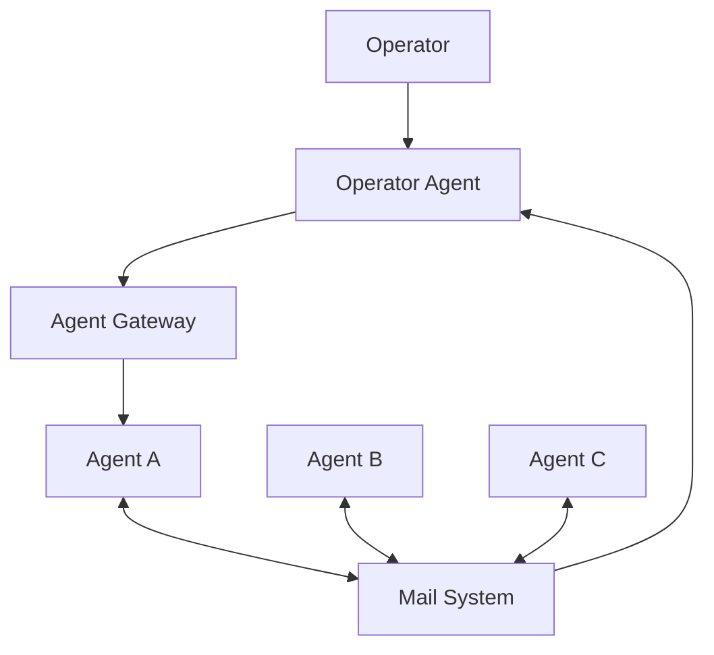
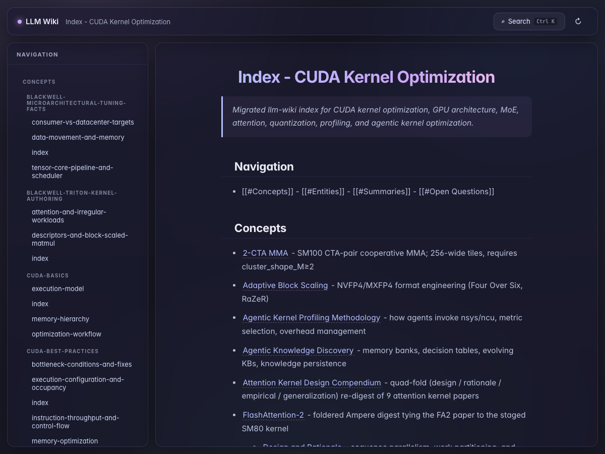

<h1 style="font-size: 2.35rem; line-height: 1.16; font-weight: 700;">
  Fast Prototyping Multi Aagent System<br/>
  with Loosely Coupled CLI Agents
</h1>

Introduction to Houmao Agent Orchestration Framework

<div class="mt-3 text-sm">
  Houmao（猴毛）:
  <a href="https://github.com/igamenovoer/houmao" target="_blank">https://github.com/igamenovoer/houmao</a>
</div>

---
layout: default
class: p-0
---

<div class="h-full w-full bg-black flex items-center justify-center">
  <div class="h-[74%] w-[78%] border border-dashed border-zinc-500 rounded flex items-center justify-center text-zinc-400 text-xl">
    Demo visual placeholder
  </div>
</div>

<div class="option-side-title" style="margin: 0.95rem 0 0.45rem; padding-bottom: 0.2rem; border-bottom: 1px solid #cbd5e1; color: #0f172a; font-size: 1.05rem; font-weight: 700; line-height: 1.2;">进一步控制 Agent Loop</div>

<div style="color: #334155; font-size: 0.95rem; line-height: 1.55;">
  如果你需要对 agent loop 做更细粒度的控制，可以使用 <code>houmao-agent-loop-lite</code> 或 <code>houmao-agent-loop-pro</code> skills。
</div>

---
layout: default
---

# 为什么需要 Multi Agent System?

<div class="grid grid-cols-[1.15fr_0.85fr] gap-6 mt-4 items-start">
<div>
  
  <div class="mt-2 text-[11px] text-zinc-500">ChatDev chat chain：把 design、coding、testing 拆成 role-pair dialogues，并通过 artifact handoffs 串起来。</div>

  <table class="mt-3 w-full text-[12px] leading-tight border-collapse">
    <thead>
      <tr class="border-b border-zinc-300 text-left">
        <th class="py-1 pr-2">Method</th>
        <th class="py-1 pr-2">Paradigm</th>
        <th class="py-1 pr-2 text-right">Complete</th>
        <th class="py-1 pr-2 text-right">Executable</th>
        <th class="py-1 pr-2 text-right">Consistent</th>
        <th class="py-1 text-right">Quality</th>
      </tr>
    </thead>
    <tbody>
      <tr class="border-b border-zinc-200">
        <td class="py-1 pr-2">GPT-Engineer</td>
        <td class="py-1 pr-2">single</td>
        <td class="py-1 pr-2 text-right">0.502</td>
        <td class="py-1 pr-2 text-right">0.358</td>
        <td class="py-1 pr-2 text-right">0.789</td>
        <td class="py-1 text-right">0.142</td>
      </tr>
      <tr class="border-b border-zinc-200">
        <td class="py-1 pr-2">MetaGPT</td>
        <td class="py-1 pr-2">multi</td>
        <td class="py-1 pr-2 text-right">0.483</td>
        <td class="py-1 pr-2 text-right">0.415</td>
        <td class="py-1 pr-2 text-right">0.760</td>
        <td class="py-1 text-right">0.152</td>
      </tr>
      <tr class="font-semibold">
        <td class="py-1 pr-2">ChatDev</td>
        <td class="py-1 pr-2">multi</td>
        <td class="py-1 pr-2 text-right">0.560</td>
        <td class="py-1 pr-2 text-right">0.880</td>
        <td class="py-1 pr-2 text-right">0.802</td>
        <td class="py-1 text-right">0.395</td>
      </tr>
    </tbody>
  </table>
</div>
<div class="text-sm">

<div class="mt-2 text-[14px] leading-snug text-zinc-700">
  ChatDev 是一个有代表性的 multi-agent software engineering system，它把不同角色分工协作的软件开发过程组织成一条清晰的协作流程。
</div>

<table class="mt-4 w-full text-[15px] leading-snug border-collapse">
  <thead>
    <tr class="border-b border-zinc-300 text-left">
      <th class="py-2 pr-4">多智能体</th>
      <th class="py-2">单智能体</th>
    </tr>
  </thead>
  <tbody>
    <tr class="border-b border-zinc-200">
      <td class="py-2 pr-4">总 context 容量更大：每个智能体都有自己的 context 窗口</td>
      <td class="py-2">只有一个固定的 context 窗口</td>
    </tr>
    <tr class="border-b border-zinc-200">
      <td class="py-2 pr-4">context 更干净：设计、编码、评审彼此分离</td>
      <td class="py-2">所有信息都挤在同一段对话里</td>
    </tr>
    <tr class="border-b border-zinc-200">
      <td class="py-2 pr-4">提示词更聚焦：每个智能体只负责一个目标</td>
      <td class="py-2">一个提示词里混杂多个目标</td>
    </tr>
    <tr class="border-b border-zinc-200">
      <td class="py-2 pr-4">采样更独立：评审者不是作者本人</td>
      <td class="py-2">自检会继承同样的盲点</td>
    </tr>
  </tbody>
</table>

<div class="mt-3 text-xs text-zinc-500">来源：Qian et al., <em>ChatDev</em>, arXiv:2307.07924.</div>

</div>
</div>

---

# 方案一：代码驱动框架

<div class="code-option-grid text-sm">
<div>

<div class="agent-square">
  <div class="agent-node node-planner">
    <div class="agent-name">PlannerAgent class</div>
    <div class="agent-api"><span>OpenAI API</span></div>
  </div>
  <div class="agent-node node-coder">
    <div class="agent-name">CoderAgent class</div>
    <div class="agent-api"><span>Claude API</span></div>
  </div>
  <div class="agent-node node-reviewer">
    <div class="agent-name">ReviewerAgent class</div>
    <div class="agent-api"><span>OpenAI API</span></div>
  </div>
  <div class="agent-node node-test">
    <div class="agent-name">TestAgent class</div>
    <div class="agent-api"><span>Claude API</span></div>
  </div>
  <div class="orchestrator-node">
    <div class="agent-name">Orchestrator class</div>
  </div>

  <div class="orchestrator-edge edge-planner"><span>plan</span></div>
  <div class="orchestrator-edge edge-coder"><span>code</span></div>
  <div class="orchestrator-edge edge-reviewer"><span>review</span></div>
  <div class="orchestrator-edge edge-test"><span>test</span></div>
</div>

</div>
<div>

<div class="option-side-title" style="margin: 0 0 0.55rem; padding-bottom: 0.2rem; border-bottom: 1px solid #cbd5e1; color: #0f172a; font-size: 1.15rem; font-weight: 700; line-height: 1.2;">优点</div>

- **控制更精细**：流程怎么走、状态怎么切换，都是明确写出来的
- **更容易验证**：路由、检查点、运行轨迹都在代码里
- **更适合正式落地**：天然贴近产品化和后台部署场景

<div class="option-side-title" style="margin: 0.9rem 0 0.55rem; padding-bottom: 0.2rem; border-bottom: 1px solid #cbd5e1; color: #0f172a; font-size: 1.15rem; font-weight: 700; line-height: 1.2;">缺点</div>

- **工程负担更重**：编排系统本身要设计、测试、维护，硬编码流程也得预先覆盖各种异常情况
- **用户难以实时介入**：除非专门设计交互界面，否则过程通常不可交互
- **迭代更困难**：系统一旦要调整，往往就得重启流程或重写程序，工程工作很多

</div>
</div>

<style>
.option-side-title {
  margin: 0.9rem 0 0.55rem;
  padding-bottom: 0.2rem;
  border-bottom: 1px solid #cbd5e1;
  color: #0f172a;
  font-size: 1.15rem;
  font-weight: 700;
  line-height: 1.2;
}

.option-side-title:first-child {
  margin-top: 0;
}

.code-option-grid {
  display: grid;
  grid-template-columns: 2fr 1fr;
  gap: 1.5rem;
}

.agent-square {
  position: relative;
  width: 100%;
  height: 320px;
}

.agent-node {
  position: absolute;
  z-index: 2;
  display: flex;
  height: 98px;
  width: 42%;
  flex-direction: column;
  justify-content: center;
  border: 2px solid #2563eb;
  border-radius: 8px;
  background: #eff6ff;
  padding: 0 14px;
  box-shadow: 0 8px 18px rgba(15, 23, 42, 0.08);
}

.orchestrator-node {
  position: absolute;
  left: 50%;
  top: 50%;
  z-index: 3;
  display: flex;
  height: 74px;
  width: 38%;
  align-items: center;
  justify-content: center;
  border: 2px solid #7c3aed;
  border-radius: 8px;
  background: #f5f3ff;
  padding: 0 12px;
  text-align: center;
  transform: translate(-50%, -50%);
  box-shadow: 0 10px 22px rgba(15, 23, 42, 0.12);
}

.agent-name {
  color: #172554;
  font-size: 17px;
  font-weight: 400;
  line-height: 1.15;
}

.agent-api {
  margin-top: 9px;
  color: #0f172a;
  font-size: 14px;
  font-weight: 400;
  line-height: 1.2;
}

.agent-api span {
  display: inline-block;
  border: 1.5px solid #0284c7;
  border-radius: 6px;
  background: #f0f9ff;
  padding: 5px 9px;
}

.node-planner {
  left: 0;
  top: 0;
}

.node-coder {
  right: 0;
  top: 0;
}

.node-reviewer {
  right: 0;
  bottom: 0;
}

.node-test {
  left: 0;
  bottom: 0;
}

.orchestrator-edge {
  position: absolute;
  z-index: 1;
  box-sizing: border-box;
  color: #334155;
  font-size: 12px;
  font-weight: 400;
}

.orchestrator-edge span {
  position: absolute;
  white-space: nowrap;
}

.orchestrator-edge::before,
.orchestrator-edge::after {
  position: absolute;
  width: 0;
  height: 0;
  content: "";
}

.edge-planner {
  left: 21%;
  top: 98px;
  width: 10%;
  height: 47px;
  border-bottom: 2px solid #334155;
  border-left: 2px solid #334155;
}

.edge-planner::before {
  left: -7px;
  top: -9px;
  border-bottom: 9px solid #334155;
  border-left: 6px solid transparent;
  border-right: 6px solid transparent;
}

.edge-planner::after {
  bottom: -7px;
  right: -9px;
  border-left: 6px solid transparent;
  border-bottom: 6px solid transparent;
  border-top: 6px solid transparent;
  border-left: 9px solid #334155;
}

.edge-planner span {
  left: 6px;
  bottom: 4px;
}

.edge-coder {
  left: 69%;
  top: 98px;
  width: 10%;
  height: 47px;
  border-bottom: 2px solid #334155;
  border-right: 2px solid #334155;
}

.edge-coder::before {
  right: -7px;
  top: -9px;
  border-bottom: 9px solid #334155;
  border-left: 6px solid transparent;
  border-right: 6px solid transparent;
}

.edge-coder::after {
  bottom: -7px;
  left: -9px;
  border-bottom: 6px solid transparent;
  border-right: 9px solid #334155;
  border-top: 6px solid transparent;
}

.edge-coder span {
  right: 6px;
  bottom: 4px;
}

.edge-reviewer {
  left: 69%;
  top: 175px;
  width: 10%;
  height: 47px;
  border-right: 2px solid #334155;
  border-top: 2px solid #334155;
}

.edge-reviewer::before {
  right: -7px;
  bottom: -9px;
  border-left: 6px solid transparent;
  border-right: 6px solid transparent;
  border-top: 9px solid #334155;
}

.edge-reviewer::after {
  left: -9px;
  top: -7px;
  border-bottom: 6px solid transparent;
  border-right: 9px solid #334155;
  border-top: 6px solid transparent;
}

.edge-reviewer span {
  right: 6px;
  top: 4px;
}

.edge-test {
  left: 21%;
  top: 175px;
  width: 10%;
  height: 47px;
  border-left: 2px solid #334155;
  border-top: 2px solid #334155;
}

.edge-test::before {
  left: -7px;
  bottom: -9px;
  border-left: 6px solid transparent;
  border-right: 6px solid transparent;
  border-top: 9px solid #334155;
}

.edge-test::after {
  right: -9px;
  top: -7px;
  border-bottom: 6px solid transparent;
  border-left: 6px solid transparent;
  border-top: 6px solid transparent;
  border-left: 9px solid #334155;
}

.edge-test span {
  left: 6px;
  top: 4px;
}
</style>

---

# 方案二：CLI 原生工具

<div class="native-option-grid text-sm">
<div>

<div class="native-agent-diagrams">
  <div class="native-panel subagent-graph">
    <div class="native-title">Subagents</div>
    <div class="native-node native-main">Main Claude<br/>session</div>
    <div class="native-node native-sub-a">Explore subagent</div>
    <div class="native-node native-sub-b">Review subagent</div>
    <div class="native-node native-sub-c">Debug subagent</div>
    <div class="native-line line-right sub-delegate-a"><span>delegate</span></div>
    <div class="native-line line-left line-dashed sub-summary-a"><span>summary</span></div>
    <div class="native-line line-right sub-delegate-b"></div>
    <div class="native-line line-left line-dashed sub-summary-b"></div>
    <div class="native-line line-right sub-delegate-c"></div>
    <div class="native-line line-left line-dashed sub-summary-c"></div>
  </div>

  <div class="native-panel team-graph">
    <div class="native-title">Agent team</div>
    <div class="native-node native-lead">Team lead</div>
    <div class="native-node native-coordination">
      <div>Shared task list</div>
      <div class="coord-divider"></div>
      <div>Mailbox / messages</div>
    </div>
    <div class="native-node native-mate-a">Teammate A</div>
    <div class="native-node native-mate-b">Teammate B</div>
    <div class="native-node native-mate-c">Teammate C</div>
    <div class="native-line line-right team-lead-link"></div>
    <div class="native-line line-right team-link-a"><span>tasks + mail</span></div>
    <div class="native-line line-right team-link-b"></div>
    <div class="native-line line-right team-link-c"></div>
    <div class="native-vline team-peer-link"></div>
  </div>
</div>

</div>
<div>

<div class="option-side-title" style="margin: 0 0 0.55rem; padding-bottom: 0.2rem; border-bottom: 1px solid #cbd5e1; color: #0f172a; font-size: 1.15rem; font-weight: 700; line-height: 1.2;">优点</div>

- **上手最快**：几乎不用额外搭系统，启动成本最低
- **文档和生态更齐全**：官方说明、使用资料和周边支持通常更完整
- **原生体验更强**：整体使用感受更像产品自带的一部分

<div class="option-side-title" style="margin: 0.9rem 0 0.55rem; padding-bottom: 0.2rem; border-bottom: 1px solid #cbd5e1; color: #0f172a; font-size: 1.15rem; font-weight: 700; line-height: 1.2;">缺点</div>

- **可控性受产品限制**：可能因厂商限制而过早终止，消息格式、处理优先级和恢复机制也未必能定制
- **平台绑定更强**：通常不支持跨平台通信，不同家的 agent 很难直接协作
- **隔离性受限**：不能让不同 agent 分别使用不同第三方模型、用户权限、Docker 环境或项目

</div>
</div>

<style>
.native-option-grid {
  display: grid;
  grid-template-columns: 2fr 1fr;
  gap: 1.5rem;
}

.native-agent-diagrams {
  position: relative;
  width: 100%;
  height: 370px;
}

.native-panel {
  position: absolute;
  left: 0;
  width: 100%;
  height: 174px;
  border: 2px solid #cbd5e1;
  border-radius: 8px;
  background: #f8fafc;
}

.subagent-graph {
  top: 0;
}

.team-graph {
  bottom: 0;
}

.native-title {
  position: absolute;
  left: 16px;
  top: 10px;
  color: #334155;
  font-size: 14px;
  font-weight: 400;
}

.native-node {
  position: absolute;
  z-index: 2;
  box-sizing: border-box;
  display: flex;
  align-items: center;
  justify-content: center;
  border: 2px solid #2563eb;
  border-radius: 8px;
  background: #eff6ff;
  color: #172554;
  padding: 0 10px;
  text-align: center;
  font-size: 13px;
  font-weight: 400;
  line-height: 1.15;
  box-shadow: 0 8px 18px rgba(15, 23, 42, 0.08);
}

.native-main {
  left: 4%;
  top: 34px;
  width: 25%;
  height: 118px;
  border-color: #7c3aed;
  background: #f5f3ff;
  color: #4c1d95;
}

.native-sub-a,
.native-sub-b,
.native-sub-c {
  left: 64%;
  width: 27%;
  height: 36px;
}

.native-sub-a {
  top: 22px;
}

.native-sub-b {
  top: 72px;
}

.native-sub-c {
  top: 122px;
}

.native-lead {
  left: 4%;
  top: 50px;
  width: 20%;
  height: 78px;
  border-color: #7c3aed;
  background: #f5f3ff;
  color: #4c1d95;
}

.native-coordination {
  left: 33%;
  top: 32px;
  width: 25%;
  height: 112px;
  flex-direction: column;
  border-color: #0f766e;
  background: #f0fdfa;
  color: #134e4a;
}

.coord-divider {
  width: 78%;
  height: 1px;
  margin: 10px 0;
  background: #99f6e4;
}

.native-mate-a,
.native-mate-b,
.native-mate-c {
  left: 72%;
  width: 23%;
  height: 36px;
}

.native-mate-a {
  top: 22px;
}

.native-mate-b {
  top: 72px;
}

.native-mate-c {
  top: 122px;
}

.native-line {
  position: absolute;
  z-index: 1;
  height: 2px;
  background: #334155;
  color: #334155;
  font-size: 12px;
  font-weight: 400;
}

.native-line span,
.native-vline span {
  position: absolute;
  white-space: nowrap;
}

.native-line span {
  left: 50%;
  top: -21px;
  transform: translateX(-50%);
}

.native-line::after,
.native-line::before,
.native-vline::after,
.native-vline::before {
  position: absolute;
  width: 0;
  height: 0;
  content: "";
}

.line-right::after {
  right: -1px;
  top: -5px;
  border-bottom: 6px solid transparent;
  border-left: 9px solid #334155;
  border-top: 6px solid transparent;
}

.line-left::before {
  left: -1px;
  top: -5px;
  border-bottom: 6px solid transparent;
  border-right: 9px solid #334155;
  border-top: 6px solid transparent;
}

.line-dashed {
  background: repeating-linear-gradient(
    to right,
    #64748b 0,
    #64748b 8px,
    transparent 8px,
    transparent 14px
  );
}

.sub-delegate-a,
.sub-summary-a,
.sub-delegate-b,
.sub-summary-b,
.sub-delegate-c,
.sub-summary-c {
  left: 29%;
  width: 35%;
}

.sub-delegate-a {
  top: 38px;
}

.sub-summary-a {
  top: 50px;
}

.sub-delegate-b {
  top: 88px;
}

.sub-summary-b {
  top: 100px;
}

.sub-delegate-c {
  top: 138px;
}

.sub-summary-c {
  top: 150px;
}

.sub-summary-a span {
  top: 7px;
}

.team-lead-link {
  left: 24%;
  top: 89px;
  width: 9%;
}

.team-link-a,
.team-link-b,
.team-link-c {
  left: 58%;
  width: 14%;
}

.team-link-a {
  top: 38px;
}

.team-link-b {
  top: 88px;
}

.team-link-c {
  top: 138px;
}

.native-vline {
  position: absolute;
  z-index: 1;
  left: 66%;
  top: 38px;
  width: 2px;
  height: 100px;
  background: #7c3aed;
  color: #334155;
  font-size: 12px;
  font-weight: 400;
}

.native-vline span {
  right: 8px;
  top: 50%;
  transform: translateY(-50%);
}

.native-vline::before {
  left: -5px;
  top: -1px;
  border-bottom: 9px solid #7c3aed;
  border-left: 6px solid transparent;
  border-right: 6px solid transparent;
}

.native-vline::after {
  bottom: -1px;
  left: -5px;
  border-left: 6px solid transparent;
  border-right: 6px solid transparent;
  border-top: 9px solid #7c3aed;
}
</style>

---

# 方案三：Houmao（猴毛）

<div class="houmao-option-grid text-sm">
<div>

<div class="houmao-model">
  <div class="hm-node hm-operator">
    Operator
    <span>human / script / agent</span>
  </div>

  <div class="hm-line hm-operator-drop"></div>
  <div class="hm-line hm-control-bus"></div>
  <div class="hm-line hm-drop-a"></div>
  <div class="hm-line hm-drop-b"></div>
  <div class="hm-line hm-drop-c"></div>

  <div class="hm-agent-stack hm-stack-a">
    <div class="hm-node hm-gateway">Agent gateway</div>
    <div class="hm-stack-line"></div>
    <div class="hm-node hm-cli">claude · tmux<span>isolated runtime home</span></div>
  </div>
  <div class="hm-agent-stack hm-stack-b">
    <div class="hm-node hm-gateway">Agent gateway</div>
    <div class="hm-stack-line"></div>
    <div class="hm-node hm-cli">codex · tmux<span>isolated runtime home</span></div>
  </div>
  <div class="hm-agent-stack hm-stack-c">
    <div class="hm-node hm-gateway">Agent gateway</div>
    <div class="hm-stack-line"></div>
    <div class="hm-node hm-cli">gemini · tmux<span>isolated runtime home</span></div>
  </div>

  <div class="hm-line hm-mail-a"></div>
  <div class="hm-line hm-mail-a-h"></div>
  <div class="hm-line hm-mail-b"></div>
  <div class="hm-line hm-mail-c"></div>
  <div class="hm-line hm-mail-c-h"></div>
  <div class="hm-node hm-mailbox">
    Shared mailbox
    <span>durable inter-agent messages</span>
  </div>
</div>
<div class="hm-caption">computer use for TUI coding agent</div>

</div>
<div>

<div class="option-side-title" style="margin: 0 0 0.55rem; padding-bottom: 0.2rem; border-bottom: 1px solid #cbd5e1; color: #0f172a; font-size: 1.15rem; font-weight: 700; line-height: 1.2;">优点</div>

- **实时观测和交互**：每个 agent 都是可直接查看、可直接介入的真实 CLI 进程
- **快速迭代，深度定制**：无代码，运行过程中也能直接调整提示词、agent 间通信、skills 和任务安排
- **运行环境更灵活**：工具、模型、技能、项目、容器和主机都可以不同

<div class="option-side-title" style="margin: 0.9rem 0 0.55rem; padding-bottom: 0.2rem; border-bottom: 1px solid #cbd5e1; color: #0f172a; font-size: 1.15rem; font-weight: 700; line-height: 1.2;">缺点</div>

- **agent 行为不确定**：相比硬编码流程，prompt 和 skill 驱动的 agent 行为每次运行都可能不同
- **可靠性不足**：依赖自定义逻辑解析 TUI 信息，不如硬编码或内部 API 调用稳定
- **学习门槛更高**：第一次真正跑起来之前，要先理解更多概念

</div>
</div>

<style>
.houmao-model {
  position: relative;
  width: 100%;
  height: 340px;
  border: 2px solid #cbd5e1;
  border-radius: 8px;
  background: #f8fafc;
}

.houmao-option-grid {
  display: grid;
  grid-template-columns: 2fr 1fr;
  gap: 1.5rem;
}

.hm-caption {
  margin-top: 8px;
  color: #475569;
  font-size: 12px;
  line-height: 1.2;
  text-align: center;
}

.hm-node {
  position: absolute;
  z-index: 2;
  box-sizing: border-box;
  display: flex;
  align-items: center;
  justify-content: center;
  flex-direction: column;
  border: 2px solid #2563eb;
  border-radius: 8px;
  background: #eff6ff;
  color: #172554;
  padding: 0 10px;
  text-align: center;
  font-size: 13px;
  font-weight: 500;
  line-height: 1.15;
  box-shadow: 0 8px 18px rgba(15, 23, 42, 0.08);
}

.hm-node span {
  display: block;
  margin-top: 5px;
  color: #475569;
  font-size: 10px;
  font-weight: 400;
}

.hm-operator {
  left: 34%;
  top: 16px;
  width: 32%;
  height: 56px;
  border-color: #7c3aed;
  background: #f5f3ff;
  color: #4c1d95;
}

.hm-agent-stack {
  position: absolute;
  top: 118px;
  width: 28%;
  height: 118px;
}

.hm-stack-a {
  left: 3%;
}

.hm-stack-b {
  left: 36%;
}

.hm-stack-c {
  left: 69%;
}

.hm-gateway,
.hm-cli {
  left: 0;
  width: 100%;
}

.hm-gateway {
  top: 0;
  height: 36px;
  border-color: #0284c7;
  background: #f0f9ff;
  color: #075985;
  font-size: 12px;
}

.hm-cli {
  top: 60px;
  height: 58px;
  border-color: #334155;
  background: #ffffff;
  color: #0f172a;
}

.hm-stack-line {
  position: absolute;
  left: 50%;
  top: 36px;
  z-index: 1;
  width: 2px;
  height: 24px;
  background: #334155;
}

.hm-line {
  position: absolute;
  z-index: 1;
  background: #334155;
}

.hm-operator-drop {
  left: 50%;
  top: 72px;
  width: 2px;
  height: 25px;
}

.hm-control-bus {
  left: 16%;
  top: 97px;
  width: 68%;
  height: 2px;
}

.hm-drop-a,
.hm-drop-b,
.hm-drop-c {
  top: 97px;
  width: 2px;
  height: 21px;
}

.hm-drop-a {
  left: 17%;
}

.hm-drop-b {
  left: 50%;
}

.hm-drop-c {
  left: 83%;
}

.hm-mailbox {
  left: 27%;
  bottom: 16px;
  width: 46%;
  height: 58px;
  border-color: #be123c;
  background: #fff1f2;
  color: #881337;
}

.hm-mail-a,
.hm-mail-b,
.hm-mail-c {
  top: 236px;
  width: 2px;
  height: 30px;
  background: repeating-linear-gradient(
    to bottom,
    #be123c 0,
    #be123c 7px,
    transparent 7px,
    transparent 12px
  );
}

.hm-mail-a {
  left: 17%;
}

.hm-mail-b {
  left: 50%;
}

.hm-mail-c {
  left: 83%;
}

.hm-mail-a-h,
.hm-mail-c-h {
  top: 266px;
  height: 2px;
  background: #be123c;
}

.hm-mail-a-h {
  left: 17%;
  width: 10%;
}

.hm-mail-c-h {
  left: 73%;
  width: 10%;
}
</style>

---

# 要不要用 Houmao？

<div class="option-side-title" style="margin: 0 0 0.55rem; padding-bottom: 0.2rem; border-bottom: 1px solid #cbd5e1; color: #0f172a; font-size: 1.15rem; font-weight: 700; line-height: 1.2;">不要把事情搞复杂</div>

- 如果单个 agent、subagent，或者工具原生的 agent team 已经够用，就先用它们。
- 只有当这些一线工具明显开始成为瓶颈时，再考虑切到 Houmao。

<div style="height: 1rem;"></div>

<div class="option-side-title" style="margin: 0 0 0.55rem; padding-bottom: 0.2rem; border-bottom: 1px solid #cbd5e1; color: #0f172a; font-size: 1.15rem; font-weight: 700; line-height: 1.2;">什么时候考虑 Houmao</div>

- **最大化可观测性和交互能力**：你希望尽可能实时看到 agent 在做什么，并且随时介入调整
- **隔离的 agent 运行环境**：你希望混用不同平台的 agent，并给它们配置不同的工具、模型、思考强度、MCP server、skills、记忆、worktree、容器或主机
- **完整控制通信机制**：你希望自己决定 prompt 怎么路由、消息怎么发、队列怎么排、哪些消息要丢弃、路由规则怎么写，以及归档如何处理
- **组织结构可动态调整**：你希望随着系统运行，持续修改 skills、角色、目标、协议、路由方式或完成条件
- **自定义容错能力**：你希望在 API 报错、网络中断、进程被杀、机器重启或状态部分损坏后，仍然能自己控制恢复过程

---

# 推荐使用场景

这些场景里，Houmao 额外带来的复杂度通常是值得的。

<div style="margin-top: 0.8rem; overflow: hidden; border: 1.5px solid #cbd5e1; border-radius: 14px; background: linear-gradient(180deg, #ffffff 0%, #f8fafc 100%); box-shadow: 0 10px 24px rgba(15, 23, 42, 0.06);">
  <table class="w-full text-[15px] leading-snug border-collapse">
    <thead>
      <tr class="text-left" style="background: linear-gradient(90deg, #dbeafe 0%, #eff6ff 100%);">
        <th class="px-4 py-3" style="width: 50%; border-right: 1px solid #cbd5e1; color: #172554; font-weight: 700;">场景</th>
        <th class="px-4 py-3" style="color: #172554; font-weight: 700;">为什么适合 Houmao</th>
      </tr>
    </thead>
    <tbody>
      <tr style="background: rgba(255,255,255,0.95);">
        <td class="px-4 py-3 align-top" style="border-top: 1px solid #e2e8f0; border-right: 1px solid #e2e8f0;">复现一篇没有官方源码的 multi-agent 论文</td>
        <td class="px-4 py-3 align-top" style="border-top: 1px solid #e2e8f0;">支持深度定制 agent 行为，同时复用 CLI 已有能力，让你把精力放在行为设计上，而不是先实现一整套可靠 agent 系统</td>
      </tr>
      <tr style="background: rgba(248,250,252,0.92);">
        <td class="px-4 py-3 align-top" style="border-top: 1px solid #e2e8f0; border-right: 1px solid #e2e8f0;">在一天内快速做出一个 multi-agent system 原型</td>
        <td class="px-4 py-3 align-top" style="border-top: 1px solid #e2e8f0;">支持实时调整 agent 行为，也不用一开始就把所有行为细节都想清楚</td>
      </tr>
      <tr style="background: rgba(255,255,255,0.95);">
        <td class="px-4 py-3 align-top" style="border-top: 1px solid #e2e8f0; border-right: 1px solid #e2e8f0;">用 OpenClaw / Hermes 驱动 Claude + Codex 开发团队</td>
        <td class="px-4 py-3 align-top" style="border-top: 1px solid #e2e8f0;">提供通信机制和 agent 生命周期管理，并且本身就是按“由其他 agent 驱动”来设计的</td>
      </tr>
      <tr style="background: rgba(248,250,252,0.92);">
        <td class="px-4 py-3 align-top" style="border-top: 1px solid #e2e8f0; border-right: 1px solid #e2e8f0;">在不稳定的运行环境里工作</td>
        <td class="px-4 py-3 align-top" style="border-top: 1px solid #e2e8f0;">agent 是独立进程，一个挂掉不会拖垮其他 agent；同时也能通过 mailbox 里的消息记录恢复工作</td>
      </tr>
    </tbody>
  </table>
</div>

<div style="margin-top: 1rem; color: #334155; font-size: 0.95rem;">共性是：你需要操作并深度定制这个 agent system，而不是只关心它的输出。</div>

<div style="height: 1.1rem;"></div>
<div style="border-top: 2px solid #cbd5e1;"></div>
<div style="height: 1.1rem;"></div>

---

# 不适合的场景

如果你并不需要 Houmao 这种操作层控制能力，那就先用更轻量、或者更产品化的工具。

<div style="margin-top: 0.8rem; overflow: hidden; border: 1.5px solid #cbd5e1; border-radius: 14px; background: linear-gradient(180deg, #ffffff 0%, #f8fafc 100%); box-shadow: 0 10px 24px rgba(15, 23, 42, 0.06);">
  <table class="w-full text-[15px] leading-snug border-collapse">
    <thead>
      <tr class="text-left" style="background: linear-gradient(90deg, #fee2e2 0%, #fef2f2 100%);">
        <th class="px-4 py-3" style="width: 50%; border-right: 1px solid #cbd5e1; color: #7f1d1d; font-weight: 700;">场景</th>
        <th class="px-4 py-3" style="color: #7f1d1d; font-weight: 700;">更合适的第一选择</th>
      </tr>
    </thead>
    <tbody>
      <tr style="background: rgba(255,255,255,0.95);">
        <td class="px-4 py-3 align-top" style="border-top: 1px solid #e2e8f0; border-right: 1px solid #e2e8f0;">想做一个要稳定跑 10,000 小时的生产级 multi-agent 服务</td>
        <td class="px-4 py-3 align-top" style="border-top: 1px solid #e2e8f0;">代码驱动框架，更适合做部署、测试、监控和 SLA 保障</td>
      </tr>
      <tr style="background: rgba(248,250,252,0.92);">
        <td class="px-4 py-3 align-top" style="border-top: 1px solid #e2e8f0; border-right: 1px solid #e2e8f0;">只是想并行处理一次性任务，比如分头搜索网页</td>
        <td class="px-4 py-3 align-top" style="border-top: 1px solid #e2e8f0;">当前 CLI 产品内置的 subagents</td>
      </tr>
      <tr style="background: rgba(255,255,255,0.95);">
        <td class="px-4 py-3 align-top" style="border-top: 1px solid #e2e8f0; border-right: 1px solid #e2e8f0;">只想让 Codex 一次性调用 Claude，或反过来</td>
        <td class="px-4 py-3 align-top" style="border-top: 1px solid #e2e8f0;">skills 和 headless calls，比如 <code>claude -p &lt;prompt&gt;</code></td>
      </tr>
      <tr style="background: rgba(248,250,252,0.92);">
        <td class="px-4 py-3 align-top" style="border-top: 1px solid #e2e8f0; border-right: 1px solid #e2e8f0;">想快速试一个 agent loop，而且只关心最终结果</td>
        <td class="px-4 py-3 align-top" style="border-top: 1px solid #e2e8f0;">工具原生的 agent teams</td>
      </tr>
    </tbody>
  </table>
</div>

<div style="margin-top: 1rem; color: #334155; font-size: 0.95rem;">共性是：你要的是结果，或者生产服务，而不是一个可观测、可操作的 agent 运行环境。</div>

---
layout: section
---

# Houmao 核心概念

从角色定义、运行实例，到通信与协作控制。

---

# Agent 核心概念

Houmao 如何定义和启动 agent。

<div class="grid grid-cols-3 gap-4 mt-5 text-[14px] leading-snug">
  <div style="border: 1.5px solid #cbd5e1; border-radius: 12px; background: #f8fafc; padding: 1rem;">
    <div style="color: #172554; font-size: 1.05rem; font-weight: 700; margin-bottom: 0.5rem;">Specialist</div>
    <div><strong>定义</strong>：某类 agent 的可复用角色包。</div>
    <div class="mt-2"><strong>动机</strong>：不用反复重写同一套角色 prompt、skills、默认配置和 memo seed。</div>
    <div class="mt-2"><strong>可以放</strong>：角色 prompt、预安装 skills、CLI tool 配置、默认 memo 内容。</div>
  </div>
  <div style="border: 1.5px solid #cbd5e1; border-radius: 12px; background: #f8fafc; padding: 1rem;">
    <div style="color: #172554; font-size: 1.05rem; font-weight: 700; margin-bottom: 0.5rem;">Launch Profile</div>
    <div><strong>定义</strong>：记录启动时参数的记录，用来给 specialist 一个运行时身份。</div>
    <div class="mt-2"><strong>动机</strong>：把同一个 specialist 每次启动时要重复填写的运行参数保存下来，让它以明确身份进入运行态。</div>
    <div class="mt-2"><strong>可以放</strong>：agent name、workdir、mailbox posture、additional system prompt and memo。</div>
  </div>
  <div style="border: 1.5px solid #cbd5e1; border-radius: 12px; background: #f8fafc; padding: 1rem;">
    <div style="color: #172554; font-size: 1.05rem; font-weight: 700; margin-bottom: 0.5rem;">Agent Instance</div>
    <div><strong>定义</strong>：正在运行的 agent 实例，由 specialist 或 launch profile 创建出来的受 Houmao 管理的 CLI 进程。</div>
    <div class="mt-2"><strong>来源</strong>：由 launch profile 启动后产生。</div>
    <div class="mt-2"><strong>运行时状态</strong>：CLI 进程、tmux session、runtime home、registry/manifest、mailbox binding、gateway state。</div>
  </div>
</div>

<div class="grid grid-cols-3 gap-4 mt-4 text-[14px] leading-snug">
  <div style="border: 1.5px solid #bfdbfe; border-radius: 12px; background: #eff6ff; padding: 0.75rem 1rem;">
    类似 class，定义可复用的 agent 模板。
  </div>
  <div style="border: 1.5px solid #bfdbfe; border-radius: 12px; background: #eff6ff; padding: 0.75rem 1rem;">
    类似 constructor params，记录启动时参数。
  </div>
  <div style="border: 1.5px solid #bfdbfe; border-radius: 12px; background: #eff6ff; padding: 0.75rem 1rem;">
    类似 object instance，是启动后的运行实体。
  </div>
</div>

---

# Multi-Agent 协作

Houmao 同时支持 agent 之间的协作，以及 operator 与 agent team 之间的协作。

<div class="grid grid-cols-[1.05fr_0.95fr] gap-6 mt-5 items-start">
<div>



</div>
<div class="text-[15px] leading-snug">

<div class="option-side-title" style="margin: 0 0 0.55rem; padding-bottom: 0.2rem; border-bottom: 1px solid #cbd5e1; color: #0f172a; font-size: 1.15rem; font-weight: 700; line-height: 1.2;">Agent 之间</div>

- 通过 mail system 交换有边界的请求和回复
- 每个 agent 保持自己的 context、tools 和 workspace
- 共享状态放在 messages 和 artifacts 里，而不是一个共享聊天窗口里

<div class="option-side-title" style="margin: 0.9rem 0 0.55rem; padding-bottom: 0.2rem; border-bottom: 1px solid #cbd5e1; color: #0f172a; font-size: 1.15rem; font-weight: 700; line-height: 1.2;">Operator 与 agents</div>

- operator 可以通过 gateway 直接 prompt、interrupt、inspect 或 recover
- operator 也可以通过 mail 查看协作状态、发送任务、归档结果
- 最终哪些输出进入 accepted work，仍然由 operator 决定

</div>
</div>

---
layout: section
---

# Agent Loop Pro Authoring

从 intention source 生成可验证、可执行的 execplan package。

---

# `init`

<div class="text-[15px] leading-snug mt-5">

- **定位**：为一个新 agent loop 创建可编辑的 source 区域。
- **输入**：loop 目录、operator 的初始目标、可选 project context。
- **边界**：只初始化 intention source，不生成 `execplan/`，也不启动 agent。

<div class="option-side-title" style="margin: 0.85rem 0 0.45rem; padding-bottom: 0.2rem; border-bottom: 1px solid #cbd5e1; color: #0f172a; font-size: 1.05rem; font-weight: 700; line-height: 1.2;">输出文件</div>

| 文件 | 作用 |
| --- | --- |
| `intention/README.md` | intention source 的入口说明，告诉后续 authoring step 应该读哪些文件、哪些内容可以人工编辑 |
| `intention/loop-overview.md` | loop 的核心意图：目标、参与者、协作流程、handoff、open questions |
| `intention/project-context.md` | 当前项目的背景事实：repo 结构、可用命令、约束、已有约定和 workspace 假设 |

</div>

---

# `create-intention`

<div class="text-[15px] leading-snug mt-5">

- **定位**：创建最小 intention source，用来承载 loop 的初始意图。
- **输入**：loop 目录、operator 对目标和参与者的描述。
- **边界**：不做 project context 探测，也不进入 execplan 生成阶段。

<div class="option-side-title" style="margin: 0.85rem 0 0.45rem; padding-bottom: 0.2rem; border-bottom: 1px solid #cbd5e1; color: #0f172a; font-size: 1.05rem; font-weight: 700; line-height: 1.2;">输出与依赖</div>

| 文件 | 类型 | 作用 |
| --- | --- | --- |
| `intention/project-context.md` | 依赖 | 项目背景事实：repo 结构、可用命令、约束、已有约定和 workspace 假设 |
| `intention/README.md` | 输出 | 最小 source 入口，说明 intention 目录是后续生成 execplan 的人工可编辑来源 |
| `intention/loop-overview.md` | 输出 | 最小 loop 意图：目标、参与者、协作流程和还没澄清的问题 |

</div>

---

# `clarify-intent`

<div class="text-[15px] leading-snug mt-5">

- **定位**：在生成 execplan 前，补齐 intention 中影响设计的关键问题。
- **输入**：`intention/` 下的目标、参与者、协作方式和约束。
- **边界**：只澄清 source intent，不直接写运行时 contract。

<div class="option-side-title" style="margin: 0.85rem 0 0.45rem; padding-bottom: 0.2rem; border-bottom: 1px solid #cbd5e1; color: #0f172a; font-size: 1.05rem; font-weight: 700; line-height: 1.2;">更新文件组</div>

| 文件组 | 作用 |
| --- | --- |
| `<loop-dir>/adrs/*.md` | 记录已接受的 intent decision：问了什么、为什么重要、最终怎么决定 |
| `intention/loop-overview.md` | 更新目标、参与者、生命周期、拓扑和整体操作模型 |
| `intention/*.md` | 按主题补充 `participants.md`、`workflow.md`、`communication.md`、`state.md`、`workspace.md`、`constraints.md` 等 source docs |
| stale report | 如果现有 `execplan/` 已经不再匹配 intention，需要明确报告它变 stale |

</div>

---

# `execplan-fast-forward`

<div class="text-[15px] leading-snug mt-5">

- **定位**：一次性把 intention source 推进成完整 execplan package。
- **输入**：已经足够清晰的 `intention/`。
- **边界**：适合快速产出骨架，不启动 agents，不替代后续 validation。

<div class="option-side-title" style="margin: 0.85rem 0 0.45rem; padding-bottom: 0.2rem; border-bottom: 1px solid #cbd5e1; color: #0f172a; font-size: 1.05rem; font-weight: 700; line-height: 1.2;">生成文件组</div>

| 文件组 | 作用 |
| --- | --- |
| `execplan/README.md`、子目录 `README.md`、`manifest.toml` | package shell 和索引：说明有哪些 generated artifacts、哪些默认层被省略 |
| `execplan/specs/**` | generated authority：process model、contracts、schema、topology、state/workspace/run 约束 |
| `execplan/harness/**`、`execplan/skills/**`、`execplan/agents/**` | 可执行表面：命令入口、agent 可用 skills、participant 到具体 agent 的绑定 |
| `execplan/docs/**` | 给 operator 读的支持文档，只总结和链接 authoritative artifacts |

</div>

---

# `execplan-step-by-step`

<div class="text-[15px] leading-snug mt-5">

- **定位**：按阶段生成 execplan，让 operator 在每个关键点确认设计。
- **输入**：`intention/`，以及 operator 对每一阶段问题的回答。
- **边界**：比 fast-forward 更可控，但需要更多人工确认。

<div class="option-side-title" style="margin: 0.85rem 0 0.45rem; padding-bottom: 0.2rem; border-bottom: 1px solid #cbd5e1; color: #0f172a; font-size: 1.05rem; font-weight: 700; line-height: 1.2;">生成文件组</div>

| 文件组 | 作用 |
| --- | --- |
| `execplan/adrs/*.md` | 记录 generation-time decisions：每一步为什么这样生成、会影响哪些 artifacts |
| `execplan/specs/**` | 逐步建立 process authority 和 contracts，让后续阶段有明确来源 |
| `execplan/harness/**`、`skills/**`、`agents/**`、`docs/**`、`manifest.toml` | 按已确认的 specs 生成 commands、skills、agent bindings、docs 和 artifact index |

</div>

---

# `execplan-specs-process`

<div class="text-[15px] leading-snug mt-5">

- **定位**：先定义协作过程，作为后续 artifact 的 process authority。
- **输入**：intention 中的目标、参与者、事件、handoff 和 recovery 设想。
- **边界**：关注 phase、event、tick、handoff 和伪代码，不生成具体 agent 绑定。

<div class="option-side-title" style="margin: 0.85rem 0 0.45rem; padding-bottom: 0.2rem; border-bottom: 1px solid #cbd5e1; color: #0f172a; font-size: 1.05rem; font-weight: 700; line-height: 1.2;">核心文件</div>

| 文件 | 作用 |
| --- | --- |
| `execplan/specs/collab/collab-overview.md` | 第一个 generated authority：定义 phases、events、handoffs、tick responsibilities、ownership、terminal posture、recovery posture |
| fenced `python` pseudocode | 把 process 写成接近可执行的流程，标出条件、动作、state effects 和 stopping points |
| fenced `mermaid` sequenceDiagram | 给人看的高层协作图，说明主要 participant/event/handoff flow |
| provisional families | 在 process 层预告 participant、message、state、记录 families，供 contracts 阶段细化 |

</div>

---

# `execplan-specs-contract`

<div class="text-[15px] leading-snug mt-5">

- **定位**：从 process spec 派生可验证的 contract 集合。
- **输入**：`collab-overview.md` 和 intention 中的约束。
- **边界**：定义结构和约束，不生成执行脚本和 skills。

<div class="option-side-title" style="margin: 0.85rem 0 0.45rem; padding-bottom: 0.2rem; border-bottom: 1px solid #cbd5e1; color: #0f172a; font-size: 1.05rem; font-weight: 700; line-height: 1.2;">contract 文件组</div>

| 文件组 | 作用 |
| --- | --- |
| `specs/objective/`、`specs/participants/` | 定义成功标准、policy、participant role templates 和 stable role instances |
| `specs/collab/topology/` | 定义 `tree-loop` 或 `generic-loop`、route graph、cycle posture、context posture |
| `specs/comms/` | 定义 mail templates、`schema_id`、JSON schemas、Markdown renderers 和 reply expectation |
| `specs/state/`、`specs/workspace/`、`specs/run/` | 定义 bookkeeping state、workspace policy、run artifacts 和结构化记录 schema |

</div>

---

# `execplan-harness`

<div class="text-[15px] leading-snug mt-5">

- **定位**：生成 loop package 自带的验证、查询、渲染、应用和控制入口。
- **输入**：process spec 和 contracts。
- **边界**：harness 服务于这个 loop，不替代 Houmao 平台级 lifecycle 命令。

<div class="option-side-title" style="margin: 0.85rem 0 0.45rem; padding-bottom: 0.2rem; border-bottom: 1px solid #cbd5e1; color: #0f172a; font-size: 1.05rem; font-weight: 700; line-height: 1.2;">harness 文件组</div>

| 文件组 | 作用 |
| --- | --- |
| `execplan/harness/commands.toml` | loop-local command registry：列出 validation、query、render、apply、control 等命令 |
| `execplan/harness/src/`、`bin/` | command implementation 和 wrapper，给 agents 或 operator 调用 |
| `execplan/harness/schemas/`、`refs/` | command envelope schema，以及指向 authoritative package artifacts 的相对引用 |
| `dependency-posture.toml`、`requirements.txt`、`vendor/` | 只在需要非标准库或 standalone/custom execution 时记录依赖姿态 |

</div>

---

# `execplan-skills`

<div class="text-[15px] leading-snug mt-5">

- **定位**：把 loop 行为编译成 agents 可以安装和调用的 generated skills。
- **输入**：process spec、contracts、事件定义和 operator control 需求。
- **边界**：每个 skill 都应该是 bounded turn，不依赖长期 in-chat wait。

<div class="option-side-title" style="margin: 0.85rem 0 0.45rem; padding-bottom: 0.2rem; border-bottom: 1px solid #cbd5e1; color: #0f172a; font-size: 1.05rem; font-weight: 700; line-height: 1.2;">skills 文件组</div>

| 文件组 | 作用 |
| --- | --- |
| `execplan/skills/README.md` | 说明 generated skill collection 的用途和内容 |
| `<loop-slug>-shared-harness/SKILL.md` | 统一说明 agents 如何使用 generated harness、contracts 和 structured outputs |
| `<loop-slug>-<role>-on-<message-family>/SKILL.md` | 处理一个具体 `schema_id` 或 event family，做一个 bounded action 后结束 |
| `<loop-slug>-<role>-tick/`、`<loop-slug>-operator-control/` | 调度/恢复/完成检查，以及 operator 的 status、pause、resume、stop、manual step 等控制 |

</div>

---

# `execplan-agent-bindings`

<div class="text-[15px] leading-snug mt-5">

- **定位**：把 participant contract 绑定到可启动的 Houmao agent 配置。
- **输入**：participants、workspace contract、generated skills 和 notifier prompt 需求。
- **边界**：只生成绑定材料，不启动 live agent。

<div class="option-side-title" style="margin: 0.85rem 0 0.45rem; padding-bottom: 0.2rem; border-bottom: 1px solid #cbd5e1; color: #0f172a; font-size: 1.05rem; font-weight: 700; line-height: 1.2;">agent binding 文件组</div>

| 文件组 | 作用 |
| --- | --- |
| `execplan/agents/bindings.toml` | 把 participant instance 映射到 concrete agent id、skills、prompt source、workspace policy 和 notifier prompt |
| `execplan/agents/profiles/<agent-id>/config.toml` | 记录准备 Houmao profile 时需要的 concrete agent 配置意图 |
| `execplan/agents/profiles/<agent-id>/definition.md`、`memo-seed.md` | agent 的 role prompt source 和可选 memo seed |
| `execplan/agents/notifier-prompts/<agent-id>.md` | mail-driven participant 被 notifier 唤醒后，如何按 `schema_id` 选择 generated skill |

</div>

---

# `execplan-finalize`

<div class="text-[15px] leading-snug mt-5">

- **定位**：整理 execplan package，让它可以被阅读、校验和执行。
- **输入**：已经生成的 specs、harness、skills 和 agent bindings。
- **边界**：docs 解释 package，但 source authority 仍然是 specs 和 contracts。

<div class="option-side-title" style="margin: 0.85rem 0 0.45rem; padding-bottom: 0.2rem; border-bottom: 1px solid #cbd5e1; color: #0f172a; font-size: 1.05rem; font-weight: 700; line-height: 1.2;">final package 文件组</div>

| 文件组 | 作用 |
| --- | --- |
| `execplan/README.md`、各目录 `README.md` | orientation docs，只说明 Purpose 和 Contents，不放 authoritative behavior |
| `execplan/manifest.toml` | final artifact index：路径、artifact kind、plan revision、generated-source posture、omissions |
| `execplan/docs/artifact-index.md` | 给人快速查 package 里有什么，每个 artifact 去哪里读 |
| `operator-guide.md`、`runtime-model.md`、`validation.md` | 总结如何操作、runtime 如何被 notifier/mail/skills 驱动、validation posture 是什么 |

</div>

---

# `validate-execplan`

<div class="text-[15px] leading-snug mt-5">

- **定位**：检查 execplan package 的结构、引用和 artifact 一致性。
- **输入**：完整或部分生成的 `execplan/`。
- **边界**：验证 package shape，不证明 live runtime 已经准备好。

<div class="option-side-title" style="margin: 0.85rem 0 0.45rem; padding-bottom: 0.2rem; border-bottom: 1px solid #cbd5e1; color: #0f172a; font-size: 1.05rem; font-weight: 700; line-height: 1.2;">检查对象</div>

| 文件组 | 检查什么 |
| --- | --- |
| `manifest.toml`、目录 `README.md` | package 是否可索引、路径是否存在、omission 是否被记录 |
| `execplan/specs/**` | process authority、contracts、topology、comms、state、workspace、run 是否一致 |
| `harness/**`、`skills/**`、`agents/**` | command registry、generated skills、agent bindings 是否符合约定且互相引用正确 |
| validation report | 报告缺失文件、parse/link failures、stale markers 和是否可进入 execution preparation |

</div>

---

# `clarify-execplan`

<div class="text-[15px] leading-snug mt-5">

- **定位**：在 execplan 已生成后，处理 implementation-level 的歧义。
- **输入**：现有 `execplan/`、validation 结果和 operator 的修正意图。
- **边界**：只改 execplan 层的歧义，不重新定义原始目标，除非同步回 intention。

<div class="option-side-title" style="margin: 0.85rem 0 0.45rem; padding-bottom: 0.2rem; border-bottom: 1px solid #cbd5e1; color: #0f172a; font-size: 1.05rem; font-weight: 700; line-height: 1.2;">可能更新的文件组</div>

| 文件组 | 作用 |
| --- | --- |
| `execplan/adrs/*.md` | 记录 accepted execplan implementation decisions，以及影响哪些 generated artifacts |
| `execplan/specs/**`、`harness/**`、`skills/**`、`agents/**` | 修正 contracts、commands、skill trigger/procedure、agent binding 或 notifier prompt |
| stale-artifact notes | 标出受影响的下游 artifacts：哪些已更新，哪些需要 regeneration 或已经 stale |

</div>

---

# `update-execplan`

<div class="text-[15px] leading-snug mt-5">

- **定位**：当 intention 或 contract 变化时，从最早受影响阶段向后刷新。
- **输入**：变更后的 source material，以及要保留或重生成的 artifact 范围。
- **边界**：避免盲目全量重写，重点是保持 artifact dependency 一致。

<div class="option-side-title" style="margin: 0.85rem 0 0.45rem; padding-bottom: 0.2rem; border-bottom: 1px solid #cbd5e1; color: #0f172a; font-size: 1.05rem; font-weight: 700; line-height: 1.2;">按影响范围刷新</div>

| 最早受影响文件组 | 后续动作 |
| --- | --- |
| `execplan/specs/collab/collab-overview.md` | process 变了，重跑 contracts、harness、skills、bindings、finalize |
| `execplan/specs/**` contracts | contracts 变了，重跑 harness、skills、bindings、finalize |
| `execplan/harness/**` 或 `execplan/skills/**` | 命令或 agent procedure 变了，重跑下游 skills/bindings/docs |
| `execplan/agents/**`、`docs/**`、`manifest.toml` | 只刷新 concrete bindings 或 final package material，并最后 `validate-execplan` |

</div>

---
layout: section
---

# Agent Loop Pro Execution

从 execplan package 准备、启动、运行和恢复 live Houmao agents。

---

# `prepare-agents`

<div class="text-[15px] leading-snug mt-5">

- **定位**：把 generated agent material 转成可启动的 Houmao agent 准备状态。
- **输入**：`execplan/agents/`、generated skills、notifier prompts 和 memo seeds。
- **输出**：specialists、launch profiles、已安装 skills 和准备报告。
- **边界**：只准备 agent 材料，不启动 CLI 进程。

</div>

---

# `prepare-workspace`

<div class="text-[15px] leading-snug mt-5">

- **定位**：按照 workspace contract 准备每个 agent 需要操作的工作区。
- **输入**：workspace contract、agent bindings 和 repo-local 约束。
- **输出**：workspace directories、state links、初始化文件和 workspace readiness report。
- **边界**：只处理 workspace 姿态，不代表 mail、gateway 或 agents 已就绪。

</div>

---

# `validate-loop`

<div class="text-[15px] leading-snug mt-5">

- **定位**：在 launch 前验证整个 loop 的 runtime readiness。
- **输入**：execplan package、prepared agents、workspace、mailbox、gateway 和 harness 状态。
- **输出**：pre-launch validation report，以及可以阻塞启动的问题清单。
- **边界**：这是运行前检查，不会替 operator 自动修复所有 runtime 问题。

</div>

---

# `launch-agents`

<div class="text-[15px] leading-snug mt-5">

- **定位**：启动 execplan 定义的 Houmao managed agents。
- **输入**：prepared launch profiles、workspace facts、mailbox 和 gateway 配置。
- **输出**：live agent ids、CLI 进程信息、gateway attachment 和 launch report。
- **边界**：启动 agents，但不一定发送 first trigger。

</div>

---

# `start`

<div class="text-[15px] leading-snug mt-5">

- **定位**：正式开始一次 loop run。
- **输入**：已启动 agents、run contract、initial event 或 operator start prompt。
- **输出**：run id、初始化 state、first trigger mail 或 prompt，以及 run log 起点。
- **边界**：只负责启动 run，不保证每个 agent 已完成后续协作。

</div>

---

# `status`

<div class="text-[15px] leading-snug mt-5">

- **定位**：只读查看 loop 当前运行状态。
- **输入**：run id、runtime state、agent liveness、mailbox 和 harness status。
- **输出**：phase、open events、pending mail、agent 状态和最近 artifact 更新。
- **边界**：不修改 state，不发送 prompt，不触发 agent 行动。

</div>

---

# `pause`

<div class="text-[15px] leading-snug mt-5">

- **定位**：暂停 loop 的自动推进或 wakeup 姿态。
- **输入**：run id、当前 scheduling/notifier 状态。
- **输出**：paused state、暂停原因和恢复提示。
- **边界**：暂停 loop 控制面，不等同于杀掉 agents 或删除 workspace。

</div>

---

# `resume`

<div class="text-[15px] leading-snug mt-5">

- **定位**：从 paused state 恢复 loop 推进。
- **输入**：run id、resume intent、必要的 repaired state。
- **输出**：恢复后的 scheduling/notifier 状态，以及下一步触发计划。
- **边界**：只恢复已经可恢复的 loop，不掩盖仍然存在的 validation 问题。

</div>

---

# `recover`

<div class="text-[15px] leading-snug mt-5">

- **定位**：处理中断、部分 handoff、失败 setup 或 runtime posture 不一致。
- **输入**：run artifacts、agent state、mailbox state、harness logs 和 operator 的恢复选择。
- **输出**：recovery plan、修复后的 state、必要的 replay 或 manual handoff。
- **边界**：恢复应保守推进，避免重复触发已经完成的关键动作。

</div>

---

# `stop`

<div class="text-[15px] leading-snug mt-5">

- **定位**：停止 loop 的运行和相关 managed agents。
- **输入**：run id、stop mode、需要保留的 artifacts 和 cleanup 策略。
- **输出**：stopped state、agent stop report、剩余 artifacts 和后续清理建议。
- **边界**：停止 live runtime，不删除历史 run artifacts，除非 contract 明确要求。

</div>

---
layout: section
---

# Reference Material

From Toy Example onward, the remaining pages are for reference only during slide development.

After the final slide deck is finished, these reference pages will be removed.

---
layout: section
---

# Toy Example

A Three-Agent Creative Writing Team

---

# 创意写作团队

一个最小但完整的 Houmao 例子，是让一个主 agent 负责最终交付，同时由几个 specialist agent 分别改进某一部分工作。

| Agent | 职责 |
| --- | --- |
| `story-writer` | 主写作者，负责推进循环，并对每一章做最终决策 |
| `character-designer` | 负责人物设定、关系备注和前后细节一致性 |
| `story-reviewer` | 负责检查剧情逻辑、节奏、前后一致性和整体质量 |

operator 负责启动并观察整个运行过程，agents 则通过路由后的 mailbox 消息彼此协作。

---

# 创意写作工作流

<div class="cw-workflows">
  <div class="cw-panel">
    <div class="cw-title">Operator drives all agents</div>
    <div class="cw-subtitle">No mailbox involved</div>
    <div class="cw-manual">
      <div class="cw-manual-body">
        <div class="cw-human-operator">
          <div class="cw-human">Human</div>
          <div class="cw-drive-line">drives</div>
          <div class="cw-node cw-operator">operator agent</div>
        </div>
        <div class="cw-prompt-stack">
          <div class="cw-prompt-row">
            <span>prompt</span>
            <i></i>
            <div class="cw-node">story-writer</div>
          </div>
          <div class="cw-prompt-row">
            <span>prompt</span>
            <i></i>
            <div class="cw-node">character-designer</div>
          </div>
          <div class="cw-prompt-row">
            <span>prompt</span>
            <i></i>
            <div class="cw-node">story-reviewer</div>
          </div>
        </div>
      </div>
    </div>
  </div>

  <div class="cw-panel">
    <div class="cw-title">Operator triggers agent loop</div>
    <div class="cw-subtitle">Agents coordinate by mail</div>
    <div class="cw-loop-map">
      <div class="cw-node cw-operator cw-loop-operator">Operator</div>
      <div class="cw-node cw-loop-writer">story-writer</div>
      <div class="cw-node cw-loop-character">character-designer</div>
      <div class="cw-node cw-loop-reviewer">story-reviewer</div>
      <div class="cw-node cw-mailbox cw-loop-mailbox">Mailbox</div>
      <div class="cw-arrow cw-operator-writer"><span>talks</span></div>
      <div class="cw-line cw-writer-spine"></div>
      <div class="cw-line cw-writer-branch"></div>
      <div class="cw-arrow-down cw-branch-character"></div>
      <div class="cw-arrow-down cw-branch-reviewer"></div>
      <div class="cw-mail-edge cw-mail-writer"></div>
      <div class="cw-mail-edge cw-mail-character"></div>
      <div class="cw-mail-edge cw-mail-reviewer"></div>
    </div>
  </div>
</div>

<style>
.cw-workflows {
  display: grid;
  grid-template-columns: 1fr 1fr;
  gap: 1.5rem;
  margin-top: 0.75rem;
}

.cw-panel {
  min-height: 270px;
  border: 2px solid #cbd5e1;
  border-radius: 8px;
  background: #f8fafc;
  padding: 12px;
}

.cw-title {
  color: #0f172a;
  font-size: 16px;
  font-weight: 600;
  line-height: 1.2;
}

.cw-subtitle {
  margin-top: 4px;
  color: #64748b;
  font-size: 12px;
}

.cw-node {
  box-sizing: border-box;
  display: flex;
  min-height: 34px;
  align-items: center;
  justify-content: center;
  border: 2px solid #2563eb;
  border-radius: 8px;
  background: #eff6ff;
  color: #172554;
  padding: 0 10px;
  text-align: center;
  font-size: 12px;
  line-height: 1.15;
}

.cw-operator {
  border-color: #7c3aed;
  background: #f5f3ff;
  color: #4c1d95;
}

.cw-mailbox {
  border-color: #be123c;
  background: #fff1f2;
  color: #881337;
}

.cw-manual {
  display: grid;
  margin-top: 12px;
}

.cw-human {
  justify-self: center;
  min-width: 88px;
  border: 2px solid #0f766e;
  border-radius: 999px;
  background: #f0fdfa;
  color: #134e4a;
  padding: 5px 24px;
  font-size: 12px;
  line-height: 1;
}

.cw-drive-line {
  color: #64748b;
  font-size: 11px;
  line-height: 1.15;
  text-align: center;
}

.cw-drive-line::before,
.cw-drive-line::after {
  display: block;
  width: 2px;
  height: 10px;
  margin: 3px auto;
  background: #64748b;
  content: "";
}

.cw-manual-body {
  display: grid;
  width: 100%;
  grid-template-columns: 0.72fr 1.28fr;
  align-items: center;
  gap: 14px;
}

.cw-human-operator {
  display: grid;
  justify-items: stretch;
}

.cw-prompt-stack {
  display: grid;
  gap: 10px;
}

.cw-prompt-row {
  display: grid;
  grid-template-columns: 42px 1fr 128px;
  align-items: center;
  gap: 8px;
  color: #475569;
  font-size: 11px;
}

.cw-prompt-row i {
  position: relative;
  display: block;
  height: 2px;
  background: #64748b;
}

.cw-prompt-row i::after {
  position: absolute;
  right: -1px;
  top: -4px;
  width: 0;
  height: 0;
  border-top: 5px solid transparent;
  border-bottom: 5px solid transparent;
  border-left: 7px solid #64748b;
  content: "";
}

.cw-loop-map {
  position: relative;
  height: 210px;
  margin-top: 12px;
}

.cw-loop-map .cw-node {
  position: absolute;
  z-index: 2;
}

.cw-loop-operator {
  left: 0;
  top: 0;
  width: 24%;
}

.cw-loop-writer {
  left: 38%;
  top: 0;
  width: 28%;
}

.cw-loop-character {
  left: 0;
  bottom: 0;
  width: 36%;
}

.cw-loop-reviewer {
  right: 0;
  bottom: 0;
  width: 34%;
}

.cw-loop-mailbox {
  left: 38%;
  top: 92px;
  width: 28%;
}

.cw-arrow,
.cw-line,
.cw-arrow-down,
.cw-mail-edge {
  position: absolute;
  z-index: 1;
  background: #64748b;
}

.cw-operator-writer {
  left: 24%;
  top: 16px;
  width: 14%;
  height: 2px;
}

.cw-operator-writer span {
  position: absolute;
  left: 50%;
  top: -16px;
  transform: translateX(-50%);
  color: #475569;
  background: #f8fafc;
  padding: 0 4px;
  font-size: 11px;
  line-height: 1;
}

.cw-arrow::after {
  position: absolute;
  right: -1px;
  top: -4px;
  width: 0;
  height: 0;
  border-top: 5px solid transparent;
  border-bottom: 5px solid transparent;
  border-left: 7px solid #64748b;
  content: "";
}

.cw-writer-spine {
  left: 52%;
  top: 34px;
  width: 2px;
  height: 32px;
}

.cw-writer-branch {
  left: 18%;
  top: 66px;
  width: 68%;
  height: 2px;
}

.cw-branch-character {
  left: 18%;
  top: 66px;
  width: 2px;
  height: 108px;
}

.cw-branch-reviewer {
  left: 86%;
  top: 66px;
  width: 2px;
  height: 108px;
}

.cw-arrow-down::after {
  position: absolute;
  left: -4px;
  bottom: -1px;
  width: 0;
  height: 0;
  border-left: 5px solid transparent;
  border-right: 5px solid transparent;
  border-top: 7px solid #64748b;
  content: "";
}

.cw-mail-edge {
  height: 0;
  border-top: 2px dashed #be123c;
  background: transparent;
  transform-origin: left center;
}

.cw-mail-writer {
  left: 52%;
  top: 92px;
  width: 58px;
  transform: rotate(-90deg);
}

.cw-mail-character {
  left: 43%;
  top: 126px;
  width: 125px;
  transform: rotate(150deg);
}

.cw-mail-reviewer {
  left: 58%;
  top: 126px;
  width: 125px;
  transform: rotate(30deg);
}
</style>

---
class: p-0
---

<div class="h-full w-full bg-black text-zinc-100 flex flex-col">
  <h1 class="px-10 pt-8 pb-3 text-3xl font-semibold">创建 Agents</h1>
  <div class="flex-1 min-h-0 px-10 pb-8">
    <div class="h-full w-full border border-dashed border-zinc-500 rounded flex items-center justify-center text-zinc-400 text-xl">
      Replacement visual slot
    </div>
  </div>
</div>

---
class: p-0
---

<div class="h-full w-full bg-black text-zinc-100 flex flex-col">
  <h1 class="px-10 pt-8 pb-3 text-3xl font-semibold">手动驱动</h1>
  <div class="flex-1 min-h-0 px-10 pb-8">
    <div class="h-full w-full border border-dashed border-zinc-500 rounded flex items-center justify-center text-zinc-400 text-xl">
      Replacement visual slot
    </div>
  </div>
</div>

---
class: p-0
---

<div class="h-full w-full bg-black text-zinc-100 flex flex-col">
  <h1 class="px-10 pt-8 pb-3 text-3xl font-semibold">Agent 循环</h1>
  <div class="flex-1 min-h-0 px-10 pb-8">
    <div class="h-full w-full border border-dashed border-zinc-500 rounded flex items-center justify-center text-zinc-400 text-xl">
      Replacement visual slot
    </div>
  </div>
</div>

---

# 总结

<div style="margin-top: 0.8rem; overflow: hidden; border: 1.5px solid #cbd5e1; border-radius: 14px; background: linear-gradient(180deg, #ffffff 0%, #f8fafc 100%); box-shadow: 0 10px 24px rgba(15, 23, 42, 0.06);">
  <table class="w-full text-[15px] leading-snug border-collapse">
    <thead>
      <tr class="text-left" style="background: linear-gradient(90deg, #dbeafe 0%, #eff6ff 100%);">
        <th class="px-4 py-3" style="white-space: nowrap; border-right: 1px solid #cbd5e1; color: #172554; font-weight: 700;">功能</th>
        <th class="px-4 py-3" style="color: #172554; font-weight: 700;">这个例子说明了什么</th>
      </tr>
    </thead>
    <tbody>
      <tr style="background: rgba(255,255,255,0.95);">
        <td class="px-4 py-3 align-top" style="white-space: nowrap; border-top: 1px solid #e2e8f0; border-right: 1px solid #e2e8f0;">Agent 创建</td>
        <td class="px-4 py-3 align-top" style="border-top: 1px solid #e2e8f0;">可以把 `story-writer`、`character-designer` 和 `story-reviewer` 定义成受管 agents</td>
      </tr>
      <tr style="background: rgba(248,250,252,0.92);">
        <td class="px-4 py-3 align-top" style="white-space: nowrap; border-top: 1px solid #e2e8f0; border-right: 1px solid #e2e8f0;">手动驱动</td>
        <td class="px-4 py-3 align-top" style="border-top: 1px solid #e2e8f0;">operator 可以直接给每个 agent 发 prompt，并观察它们的响应</td>
      </tr>
      <tr style="background: rgba(255,255,255,0.95);">
        <td class="px-4 py-3 align-top" style="white-space: nowrap; border-top: 1px solid #e2e8f0; border-right: 1px solid #e2e8f0;">自动驱动</td>
        <td class="px-4 py-3 align-top" style="border-top: 1px solid #e2e8f0;">operator 启动循环后，可以让 `story-writer` 自己协调后续工作</td>
      </tr>
      <tr style="background: rgba(248,250,252,0.92);">
        <td class="px-4 py-3 align-top" style="white-space: nowrap; border-top: 1px solid #e2e8f0; border-right: 1px solid #e2e8f0;">Mailbox 子系统</td>
        <td class="px-4 py-3 align-top" style="border-top: 1px solid #e2e8f0;">agents 可以通过持久化邮件交换请求和回复</td>
      </tr>
      <tr style="background: rgba(255,255,255,0.95);">
        <td class="px-4 py-3 align-top" style="white-space: nowrap; border-top: 1px solid #e2e8f0; border-right: 1px solid #e2e8f0;">Agent gateway</td>
        <td class="px-4 py-3 align-top" style="border-top: 1px solid #e2e8f0;">operator 可以查看、prompt、打断并恢复正在运行的 agents</td>
      </tr>
    </tbody>
  </table>
</div>

<div class="option-side-title" style="margin: 0.95rem 0 0.45rem; padding-bottom: 0.2rem; border-bottom: 1px solid #cbd5e1; color: #0f172a; font-size: 1.05rem; font-weight: 700; line-height: 1.2;">进一步控制 Agent Loop</div>

<div style="color: #334155; font-size: 0.95rem; line-height: 1.55;">
  如果你需要对 agent loop 做更细粒度的控制，可以使用 <code>houmao-agent-loop-lite</code> 或 <code>houmao-agent-loop-pro</code> skills。
</div>

---
layout: section
---

# CUDA Kernel 优化

Houmao 如何把 kernel 调优变成一个可持续运行的 multi-agent 搜索循环。

---

# 角色与 Agent 循环

这次运行用了 5 个 Codex CLI 进程：1 个 lead、1 个 reviewer、3 个 coder。Houmao 把整个 kernel 搜索过程组织成一个由 lead 持有的 variant beam search。

<div class="cuda-loop-grid">
  <div class="cuda-diagram cuda-flow">
    <div class="cuda-title">Beam Search 循环</div>
    <div class="cuda-node cuda-step cuda-step-1">1. 选一个待优化的 kernel variant</div>
    <div class="cuda-arrow-down cuda-flow-arrow-1"></div>
    <div class="cuda-node cuda-step cuda-step-2">2. Lead 决定走增量优化还是结构优化</div>
    <div class="cuda-arrow-down cuda-flow-arrow-2"></div>
    <div class="cuda-node cuda-step cuda-step-3">3. Reviewer 给方向</div>
    <div class="cuda-arrow-down cuda-flow-arrow-3"></div>
    <div class="cuda-node cuda-step cuda-step-4">4. Coder 实现 + Reviewer 评估性能<br/><span>（nsys / ncu）</span></div>
    <div class="cuda-arrow-down cuda-flow-arrow-4"></div>
    <div class="cuda-node cuda-step cuda-step-decision">5. Lead 判断继续增量修复还是转向结构探索</div>
    <div class="cuda-outcome-row">
      <div class="cuda-outcome cuda-outcome-promote">
        <div class="cuda-outcome-title">继续增量修复</div>
        <div class="cuda-outcome-body">保留当前方向<br/>继续打磨</div>
      </div>
      <div class="cuda-outcome cuda-outcome-retry">
        <div class="cuda-outcome-title">转向结构探索</div>
        <div class="cuda-outcome-body">换更大的改法<br/>重新试</div>
      </div>
      <div class="cuda-outcome cuda-outcome-close">
        <div class="cuda-outcome-title">结束这个方向</div>
        <div class="cuda-outcome-body">没有价值就关闭</div>
      </div>
    </div>
  </div>
  <div class="cuda-diagram cuda-team">
    <div class="cuda-title">5 个 CLI 进程</div>
    <div class="cuda-node cuda-lead">
      <div>Lead</div>
      <span>（循环 owner）</span>
    </div>
    <div class="cuda-node cuda-reviewer">Reviewer<br/><span>评估 + 方案</span></div>
    <div class="cuda-node cuda-coder-a">Coder</div>
    <div class="cuda-node cuda-coder-b">Coder</div>
    <div class="cuda-node cuda-coder-c">Coder</div>
    <div class="cuda-team-edge edge-lead-reviewer"><span>review request</span></div>
    <div class="cuda-team-reply edge-reviewer-lead-reply"><span>reply</span></div>
    <div class="cuda-team-edge edge-lead-coder-a"><span>implementation request</span></div>
    <div class="cuda-team-reply edge-coder-a-lead-reply"><span>reply</span></div>
    <div class="cuda-team-edge edge-lead-coder-b"></div>
    <div class="cuda-team-reply edge-coder-b-lead-reply"></div>
    <div class="cuda-team-edge edge-lead-coder-c"></div>
    <div class="cuda-team-reply edge-coder-c-lead-reply"></div>
  </div>
</div>

<style>
.cuda-loop-grid {
  display: grid;
  grid-template-columns: 1fr 1fr;
  gap: 1.25rem;
  margin-top: 0.75rem;
  height: 70%;
  align-items: stretch;
}

.cuda-diagram {
  position: relative;
  height: 100%;
  border: 2px solid #cbd5e1;
  border-radius: 8px;
  background: #f8fafc;
}

.cuda-title {
  position: absolute;
  left: 14px;
  top: 10px;
  color: #334155;
  font-size: 13px;
  font-weight: 600;
}

.cuda-node {
  position: absolute;
  z-index: 2;
  box-sizing: border-box;
  display: flex;
  min-height: 38px;
  align-items: center;
  justify-content: center;
  border: 2px solid #2563eb;
  border-radius: 8px;
  background: #eff6ff;
  color: #172554;
  padding: 0 10px;
  text-align: center;
  font-size: 11px;
  line-height: 1.15;
  box-shadow: 0 8px 18px rgba(15, 23, 42, 0.08);
}

.cuda-node span {
  color: #475569;
  font-size: 10px;
}

.cuda-edge,
.cuda-team-edge {
  position: absolute;
  z-index: 1;
  height: 2px;
  background: #334155;
  color: #475569;
  font-size: 10px;
  line-height: 1;
}

.cuda-edge span,
.cuda-team-edge span {
  position: absolute;
  left: 50%;
  top: -15px;
  transform: translateX(-50%);
  white-space: nowrap;
}

.cuda-edge::after,
.cuda-team-edge::after {
  position: absolute;
  top: -5px;
  width: 0;
  height: 0;
  border-bottom: 6px solid transparent;
  border-top: 6px solid transparent;
  content: "";
}

.cuda-edge::after {
  right: -1px;
  border-left: 9px solid #334155;
}

.cuda-team-reply {
  position: absolute;
  z-index: 1;
  height: 0;
  border-top: 2px dashed #94a3b8;
  color: #64748b;
  font-size: 10px;
  line-height: 1;
}

.cuda-team-reply span {
  position: absolute;
  left: 50%;
  top: -15px;
  transform: translateX(-50%);
  white-space: nowrap;
}

.cuda-team-reply::before {
  position: absolute;
  left: -1px;
  top: -5px;
  width: 0;
  height: 0;
  border-bottom: 6px solid transparent;
  border-top: 6px solid transparent;
  border-right: 9px solid #94a3b8;
  content: "";
}

.cuda-team-edge::after {
  right: -1px;
  border-left: 9px solid #334155;
}

.cuda-step {
  left: 10%;
  width: 80%;
  min-height: 32px;
  justify-content: flex-start;
  padding: 0 12px;
  text-align: left;
}

.cuda-step span {
  color: #475569;
  font-size: 10px;
}

.cuda-step-1 {
  top: 42px;
}

.cuda-step-2 {
  top: 87px;
}

.cuda-step-3 {
  top: 132px;
}

.cuda-step-4 {
  top: 177px;
}

.cuda-step-decision {
  top: 230px;
  border-color: #7c3aed;
  background: #f5f3ff;
  color: #4c1d95;
}

.cuda-arrow-down {
  position: absolute;
  left: 50%;
  width: 2px;
  background: #64748b;
  transform: translateX(-50%);
}

.cuda-arrow-down::after {
  position: absolute;
  left: 50%;
  bottom: -1px;
  width: 0;
  height: 0;
  border-left: 6px solid transparent;
  border-right: 6px solid transparent;
  border-top: 8px solid #64748b;
  content: "";
  transform: translateX(-50%);
}

.cuda-flow-arrow-1 {
  top: 74px;
  height: 12px;
}

.cuda-flow-arrow-2 {
  top: 119px;
  height: 12px;
}

.cuda-flow-arrow-3 {
  top: 164px;
  height: 12px;
}

.cuda-flow-arrow-4 {
  top: 209px;
  height: 12px;
}

.cuda-outcome-row {
  position: absolute;
  left: 8%;
  right: 8%;
  top: 272px;
  display: grid;
  grid-template-columns: 1fr 1fr 1fr;
  gap: 8px;
}

.cuda-outcome {
  min-height: 56px;
  border: 2px solid #cbd5e1;
  border-radius: 8px;
  background: #fff;
  padding: 6px 8px;
  text-align: center;
  box-shadow: 0 8px 18px rgba(15, 23, 42, 0.05);
}

.cuda-outcome-title {
  font-size: 10px;
  font-weight: 700;
  line-height: 1.15;
}

.cuda-outcome-body {
  margin-top: 3px;
  font-size: 10px;
  line-height: 1.15;
}

.cuda-outcome-promote {
  border-color: #0f766e;
  background: #f0fdfa;
  color: #134e4a;
}

.cuda-outcome-retry {
  border-color: #ca8a04;
  background: #fefce8;
  color: #713f12;
}

.cuda-outcome-close {
  border-color: #64748b;
  background: #f1f5f9;
  color: #334155;
}

.cuda-lead {
  left: 6%;
  top: 42px;
  width: 25%;
  height: 239px;
  flex-direction: column;
  border-color: #7c3aed;
  background: #f5f3ff;
  color: #4c1d95;
}

.cuda-reviewer {
  left: 62%;
  top: 44px;
  width: 32%;
  height: 52px;
  border-color: #0f766e;
  background: #f0fdfa;
  color: #134e4a;
}

.cuda-coder-a,
.cuda-coder-b,
.cuda-coder-c {
  left: 62%;
  width: 32%;
  height: 42px;
}

.cuda-coder-a {
  top: 111px;
}

.cuda-coder-b {
  top: 175px;
}

.cuda-coder-c {
  top: 239px;
}

.edge-lead-reviewer {
  left: 31%;
  top: 70px;
  width: 31%;
}

.edge-lead-reviewer span {
  top: -17px;
}

.edge-reviewer-lead-reply {
  left: 31%;
  top: 84px;
  width: 31%;
}

.edge-reviewer-lead-reply span {
  top: 5px;
}

.edge-lead-coder-a {
  left: 31%;
  top: 132px;
  width: 31%;
}

.edge-lead-coder-a span {
  top: -17px;
}

.edge-coder-a-lead-reply {
  left: 31%;
  top: 146px;
  width: 31%;
}

.edge-coder-a-lead-reply span {
  top: 5px;
}

.edge-lead-coder-b {
  left: 31%;
  top: 196px;
  width: 31%;
}

.edge-coder-b-lead-reply {
  left: 31%;
  top: 210px;
  width: 31%;
}

.edge-lead-coder-c {
  left: 31%;
  top: 260px;
  width: 31%;
}

.edge-coder-c-lead-reply {
  left: 31%;
  top: 274px;
  width: 31%;
}
</style>

---

# 知识库构建

从公开的代码、白皮书、教程、论文中梳理 CUDA 优化的各种技巧。

LLM-wiki skill: <https://github.com/imsight-forks/llm-wiki-skill>

<div style="display: grid; grid-template-columns: 1.15fr 0.85fr; gap: 1.25rem; margin-top: 0.9rem; align-items: start;">
  <div style="overflow: hidden; border: 1.5px solid #cbd5e1; border-radius: 14px; background: linear-gradient(180deg, #ffffff 0%, #f8fafc 100%); box-shadow: 0 10px 24px rgba(15, 23, 42, 0.06);">
    
  </div>
  <div>
    <div class="option-side-title" style="margin: 0 0 0.55rem; padding-bottom: 0.2rem; border-bottom: 1px solid #cbd5e1; color: #0f172a; font-size: 1.05rem; font-weight: 700; line-height: 1.2;">Source Material</div>
    <div style="display: grid; gap: 0.65rem; color: #334155; font-size: 0.95rem; line-height: 1.45;">
      <div>- CUDA 指南和既有笔记</div>
      <div>- CUTLASS / CuTe 和 FlashInfer 代码</div>
      <div>- MoE 论文和 benchmark 代码</div>
      <div>- Hopper / Blackwell 白皮书</div>
      <div>- NVIDIA 官方 blog 和教程</div>
      <div>- Triton / TVM-FFI 相关资料</div>
      <div>- DeepGEMM / SonicMoE 等开源实现</div>
      <div>- CUDA 最佳实践文档</div>
    </div>
  </div>
</div>

这个知识库既足够广，方便随时查；也足够结构化，能进一步沉淀成可复用的角色规则。

---

# CUDA 优化 Skills

从知识库提炼出来的通用 CUDA 优化 skills。

<div style="margin-top: 0.9rem; overflow: hidden; border: 1.5px solid #cbd5e1; border-radius: 14px; background: linear-gradient(180deg, #ffffff 0%, #f8fafc 100%); box-shadow: 0 10px 24px rgba(15, 23, 42, 0.06);">
  <table class="w-full text-[15px] leading-snug border-collapse">
    <thead>
      <tr class="text-left" style="background: linear-gradient(90deg, #dbeafe 0%, #eff6ff 100%);">
        <th class="px-4 py-3" style="width: 32%; border-right: 1px solid #cbd5e1; color: #172554; font-weight: 700;">Skill</th>
        <th class="px-4 py-3" style="color: #172554; font-weight: 700;">内容</th>
      </tr>
    </thead>
    <tbody>
      <tr style="background: rgba(255,255,255,0.95);">
        <td class="px-4 py-3 align-top" style="border-top: 1px solid #e2e8f0; border-right: 1px solid #e2e8f0;"><code>cuda-coding</code></td>
        <td class="px-4 py-3 align-top" style="border-top: 1px solid #e2e8f0;">CUDA 代码实现规范：正确性、访存、同步、dtype 选择和资源权衡</td>
      </tr>
      <tr style="background: rgba(248,250,252,0.92);">
        <td class="px-4 py-3 align-top" style="border-top: 1px solid #e2e8f0; border-right: 1px solid #e2e8f0;"><code>cuda-binding</code></td>
        <td class="px-4 py-3 align-top" style="border-top: 1px solid #e2e8f0;">TVM-FFI / Torch 入口、destination-passing、stream 处理、workspace ownership 和 build flags</td>
      </tr>
      <tr style="background: rgba(255,255,255,0.95);">
        <td class="px-4 py-3 align-top" style="border-top: 1px solid #e2e8f0; border-right: 1px solid #e2e8f0;"><code>low-precision-kernel-formats</code></td>
        <td class="px-4 py-3 align-top" style="border-top: 1px solid #e2e8f0;">FP8 和 block-scale 格式约束，包括 scale layout 和 quantization boundary</td>
      </tr>
      <tr style="background: rgba(248,250,252,0.92);">
        <td class="px-4 py-3 align-top" style="border-top: 1px solid #e2e8f0; border-right: 1px solid #e2e8f0;"><code>cuda-profiling</code></td>
        <td class="px-4 py-3 align-top" style="border-top: 1px solid #e2e8f0;"><code>nsys</code> / <code>ncu</code> 热点定位、瓶颈分类和 profiler-to-source attribution</td>
      </tr>
      <tr style="background: rgba(255,255,255,0.95);">
        <td class="px-4 py-3 align-top" style="border-top: 1px solid #e2e8f0; border-right: 1px solid #e2e8f0;"><code>cuda-generic-optimization</code></td>
        <td class="px-4 py-3 align-top" style="border-top: 1px solid #e2e8f0;">在定位到瓶颈之后，决定下一步局部实验怎么做</td>
      </tr>
      <tr style="background: rgba(248,250,252,0.92);">
        <td class="px-4 py-3 align-top" style="border-top: 1px solid #e2e8f0; border-right: 1px solid #e2e8f0;"><code>cuda-structural-optimization</code></td>
        <td class="px-4 py-3 align-top" style="border-top: 1px solid #e2e8f0;">更大粒度的 kernel 重构：stage 边界、调度方式、核心 primitive 和 metadata flow</td>
      </tr>
      <tr style="background: rgba(255,255,255,0.95);">
        <td class="px-4 py-3 align-top" style="border-top: 1px solid #e2e8f0; border-right: 1px solid #e2e8f0;"><code>hw-aware-optimization</code></td>
        <td class="px-4 py-3 align-top" style="border-top: 1px solid #e2e8f0;">面向 B200 / SM100 的硬件感知规划，以及架构相关代码形态</td>
      </tr>
    </tbody>
  </table>
</div>

---

# Kernel 性能演进

multi agent 算子优化路径。

| 轮次 | 主要思路 | 加速比 |
| ---: | --- | --- |
| 001 | adaptive 1SM / 2SM schedule restore | medium `2.14x` |
| 002 | count-aware launch metadata | medium `5.28x` |
| 008 | persistent router / compactor / pack | all `30.80x` |
| 015 | matured persistent pipeline tip | all `32.12x / 7.26x` |
| 027 | device-launched descriptor classifier | all `35.17x / 9.53x` |
| 054 | token-broadcast ingress fabric | all `32.71x / 6.33x` |

官方 Docker 自测：19/19 个公开 MoE workloads 全部通过，平均 `27.63x`，最小 `6.31x`。

---

# Thank You

<div class="grid grid-cols-2 gap-8 mt-6">
<div>

<div style="margin: 0 0 0.7rem; padding-bottom: 0.2rem; border-bottom: 1px solid #cbd5e1; color: #0f172a; font-size: 1.05rem; font-weight: 700; line-height: 1.2;">UV Install</div>

```bash
uv tool install houmao
```

</div>
<div>

<div style="margin: 0 0 0.7rem; padding-bottom: 0.2rem; border-bottom: 1px solid #cbd5e1; color: #0f172a; font-size: 1.05rem; font-weight: 700; line-height: 1.2;">Skill Install</div>

```bash
npx skills add \
  "https://github.com/igamenovoer/houmao/tree/main/"\
  "src/houmao/agents/assets/system_skills/"
```

```bash
houmao-mgr system-skills install --tool claude
houmao-mgr system-skills install --tool codex
houmao-mgr system-skills install --tool gemini
```

</div>
</div>

<div class="grid grid-cols-2 gap-8 mt-6">
<div>

<div style="margin: 0 0 0.7rem; padding-bottom: 0.2rem; border-bottom: 1px solid #cbd5e1; color: #0f172a; font-size: 1.05rem; font-weight: 700; line-height: 1.2;">GitHub</div>

<a class="text-sm" href="https://github.com/igamenovoer/houmao" target="_blank">
  https://github.com/igamenovoer/houmao
</a>

</div>
<div>

<div style="margin: 0 0 0.7rem; padding-bottom: 0.2rem; border-bottom: 1px solid #cbd5e1; color: #0f172a; font-size: 1.05rem; font-weight: 700; line-height: 1.2;">PyPI</div>

<a class="text-sm" href="https://pypi.org/project/houmao/" target="_blank">
  https://pypi.org/project/houmao/
</a>

</div>
</div>
