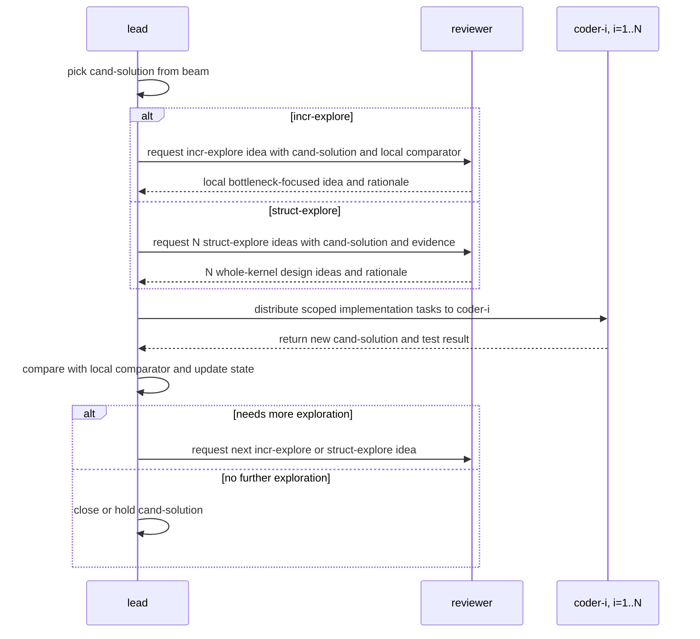

# Lead-Code-Review Agent Team Idea

## Objective

Optimize the MoE kernel for the MLSys26 contest through a simple lead-review-code loop. The team should keep the work moving by separating decision making, review, and implementation, so each round produces either a concrete kernel change, a clearer diagnosis, or a better next optimization direction.

## Team Members

- `lead`: Owns the objective, keeps track of the best states, maintains the ranked beam of cand-solutions, decides what to try next, and assigns work to the reviewer and coders.
- `reviewer`: Inspects cand-solutions, checks evidence, identifies problems or opportunities, and proposes repair, incr-explore, or struct-explore directions.
- `coder-i`: Implements one lead-approved task and reports what changed, for `i = 1, 2, ..., N`.

## Solution Concepts

- `cand-solution`: a candidate solution tracked in the beam; its state is one of `immature`, `matured`, `closed`, or `blocked`.
- `immature`: an active cand-solution that still needs local exploration through coder attempts and reviewer evaluation.
- `matured`: a cand-solution that has received enough local improvement attempts to be deemed not locally improvable anymore, making it eligible for struct-explore or promotion comparison.
- `closed`: a cand-solution that will not be further explored.
- `blocked`: a cand-solution that cannot currently be evaluated because of a concrete runtime, tooling, data, or environment blocker.
- `global-best`: the best correct solution seen anywhere in the run, including closed branches.
- `open-best`: the best promoted solution among cand-solutions that are still active; this is the promotion comparator.

## Exploration Concepts

- `local comparator`: the previous iteration of the cand-solution, used to decide whether a new attempt locally improves it.
- `incr-explore`: one incremental exploration of a cand-solution that keeps the grand structure of the solution and makes focused local adjustments to improve performance, mainly around a found bottleneck.
- `struct-explore`: one structural exploration effort that considers the kernel as a whole, tries to identify design issues based on multiple profiled metrics, code patterns, or domain knowledge, and comes up with an improved design.

## Agent Coordination

The coordination is a beam-style loop over cand-solutions. `lead` repeatedly picks a cand-solution, asks `reviewer` for either an incr-explore idea or a struct-explore idea, sends the resulting task to coders, and uses the returned cand-solution to update the beam.

There are N coders, and a struct-explore request asks reviewer for N struct-explore ideas so each idea can be assigned to one coder.

1. `lead` picks a cand-solution from the current beam and decides whether it needs an incr-explore idea or N struct-explore ideas.
2. `lead` sends that cand-solution to `reviewer` with the requested exploration type.
3. `reviewer` studies the cand-solution and returns an exploration idea with the reasoning behind it.
4. `lead` turns the reviewer idea or N struct-explore ideas into coder tasks and distributes them to `coder-i`, where `i = 1, 2, ..., N`.
5. Each assigned `coder-i` implements and tests its task, then reports a new cand-solution back to `lead`.
6. `lead` compares the new cand-solution with its local comparator, updates its state, and decides what to ask `reviewer` for next: more incr-explore, struct-explore, or no further exploration.
7. The loop repeats over the updated beam until the operator stops or changes the goal.
