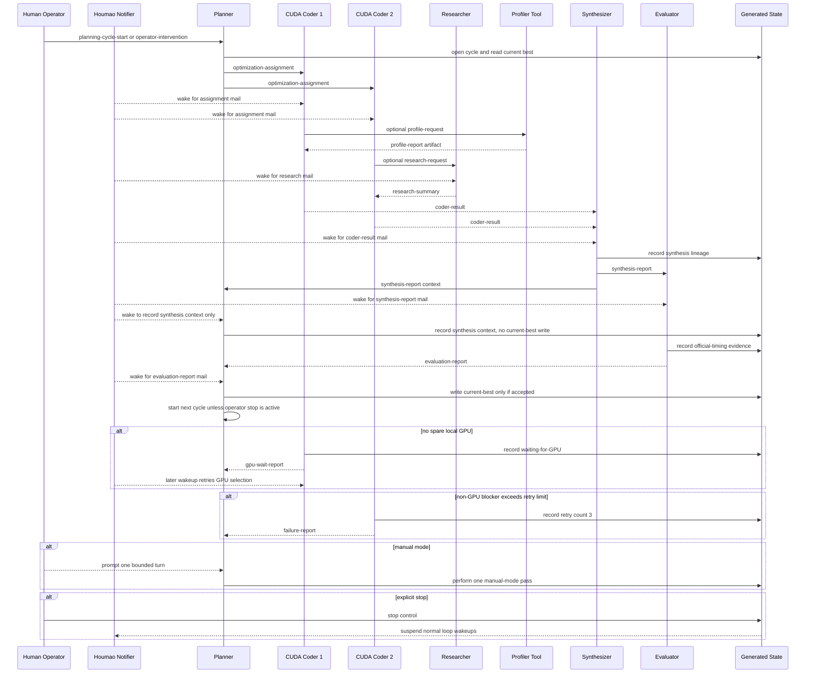

# Generated Process Overview: lead-code-synth-research

This file is generated execplan material derived from `teams/lead-code-synth-research/intention/` and accepted ADRs. Edit the intention source or ADRs first when process intent changes, then regenerate downstream execplan stages.

## Scope

- First-scope workload: `moe_fp8_block_scale_ds_routing_topk8_ng8_kg4_e32_h7168_i2048`.
- Runtime posture: launchable live Houmao loop with managed agents, mail/gateway communication, generated state, run artifacts, run controls, launch readiness checks, and local spare-GPU selection for exploratory CUDA work.
- Managed agents: Planner, CUDA Coder 1, CUDA Coder 2, Synthesizer, Researcher, and Evaluator.
- Tool surfaces: Profiler is a generated tool or skill surface invoked by managed agents; it is not a live managed agent and has no mailbox or workspace of its own.
- Workspaces: six isolated managed-agent workspaces, one per managed agent. Coordination uses Houmao mail, generated state, run artifacts, and explicit refs rather than shared coordination writes.
- Out of scope for this first process model: DSA TopK, DSA Sparse Attention, platform setup, runtime launch, concrete schemas, harness command shapes, generated skills, generated agent bindings, and final package docs.

## Topology

Selected topology mode: `generic-loop`.

The loop is a directed graph with parallel Coder branches and repeated planning cycles. Normal work moves from Planner to the two CUDA Coders, then to Synthesizer, then to Evaluator, then back to Planner through accepted or rejected evaluation evidence. Researcher is reachable from Planner, Coders, and Synthesizer. Managed agents invoke the Profiler tool surface when profiling evidence is useful.

Normal directed routes:

- Human Operator to Planner: start, stop, pause, resume, redirect, invalidate, or force a new cycle.
- Planner to CUDA Coder 1 and CUDA Coder 2: optimization assignments with distinct directions and one bounded attempt per assignment.
- CUDA Coders to Synthesizer: routine `coder-result` mail containing candidate evidence, `project-cli` variant id or variant directory ref, Coder workspace path, changed-file summaries, local-check status, and blocker reports.
- Planner, CUDA Coders, or Synthesizer to Researcher: research requests with default parallel local-and-network source scope unless the request explicitly narrows scope.
- Researcher to requester, and optionally Planner: research summaries with source-scope notes and reusable ideas.
- Planner, CUDA Coders, Synthesizer, or Evaluator to Profiler tool surface: profiling requests or direct tool invocations.
- Profiler tool surface to invoking agent: profile reports as artifacts or structured evidence refs.
- Synthesizer to Evaluator and Planner: selected or merged promotion candidate with lineage, `project-cli` variant id or variant directory ref, workspace path, and evidence refs. Evaluator treats the report as a promotion review input; Planner treats the report as context only.
- Evaluator to Planner: accepted or rejected promotion evidence after `official-timing`.
- Planner to generated state: planning-cycle records and current-best writes after accepted Evaluator evidence.

Cycle control:

- Each planning cycle has a stable `cycle_id`.
- Planner emits up to two Coder assignments per ordinary cycle, one per Coder slot.
- Each assignment has a stable `assignment_id`, owner Coder, optimization direction, current-best refs, expected evidence, allowed edit surface, and risk notes.
- Each Coder performs one bounded attempt for its assignment, then reports evidence, failure, or waiting-for-GPU state and stops the turn.
- Synthesizer may proceed with available Coder results when generated state shows the other assignment is waiting for GPU or has failed after allowed retries.
- Evaluator decides promotion eligibility only after project `official-timing`; Evaluator does not write current-best state.
- Planner writes current-best state only from accepted Evaluator promotion evidence, then continues the loop or follows operator control state.

Dedupe and repeat-visit posture:

- Planner should not reissue the same direction without recording new context, a different hypothesis, changed current-best state, or an operator redirect.
- Failed directions, suspected causes, rejected candidates, invalid-speedup findings, and preserved ideas remain queryable for later planning.
- Candidate ids and assignment ids prevent duplicate promotion, duplicate evaluation, and accidental result reuse across cycles.
- Repeating a participant in a later cycle is expected; repeating the same message payload without new context is a recovery or validation concern.

Termination:

- There is no built-in success completion condition.
- Promotion, budget pressure, repeated failures, plateau reports, and blocker reports do not complete the loop.
- Only an explicit Human Operator stop ends the loop.

## Participants and Ownership

- Human Operator: controls stop, pause, resume, redirect, invalidate, force-new-cycle, and major constraint changes. The operator does not hand-tune kernel code as part of normal loop work.
- Planner: owns planning-cycle state, current-best reads, assignment issuance, history review, and current-best writes after accepted Evaluator promotion evidence.
- CUDA Coder 1 and CUDA Coder 2: share one Coder role profile, work in separate workspaces, implement distinct Planner-assigned directions, run local checks on a dynamically selected spare local GPU when available, and report one bounded attempt.
- Synthesizer: compares Coder outputs, selects or merges a promotion candidate, records lineage, preserves useful partial ideas, and sends promotion submissions to Evaluator. Synthesizer does not promote candidates or write current-best state.
- Researcher: searches local reference material and network sources concurrently by default, then reports source scope, source attribution, reusable patterns, speculative ideas, and risk notes.
- Evaluator: runs correctness and benchmark gates, uses `official-timing` for promotion eligibility, rejects invalid or hacked candidates, records evaluation evidence, and sends accepted promotion evidence to Planner. Evaluator does not write current-best state.
- Profiler tool surface: provides generated profiling commands or skill guidance for managed agents that need bottleneck evidence. Profile outputs attach to run artifacts, candidate evidence, or state refs.

## Runtime Trigger Model

Normal communication is mail-driven. Houmao mail/notifier support wakes target agents when open mail exists. A notified agent selects the generated on-event skill for the incoming `schema_id`, processes one bounded event, optionally runs one generated on-tick pass if the notifier or skill requires follow-up scheduling or reconciliation, then ends the chat turn.

Execution modes are separate from run lifecycle state:

- `auto`: default initial mode. Mail notifier prompts drive on-event work and any immediate follow-up tick pass.
- `manual`: notifier wakeups for this loop are suspended or disabled, and the Human Operator prompts one bounded participant turn at a time.

On-event responsibilities:

- Inspect the `houmao-email-metadata` block in the received mail.
- Match the exact `schema_id` to the generated event skill.
- Validate or repair payload refs when the process family allows repair.
- Perform one role-owned bounded action.
- Emit any required reply, forward, record, or failure report.
- Stop the turn after the bounded action.

On-tick responsibilities:

- Query run state, execution mode, active ownership, open assignments, retry counters, waiting-for-GPU records, and pending result routes.
- In `auto` mode, perform one notifier-prompted follow-up pass when a mail event created schedulable work.
- In `manual` mode, perform one operator-prompted pass and report what was done.
- Retry eligible non-GPU blockers only while retry count is less than three.
- Requeue or report waiting-for-GPU records only through a later notifier or operator wakeup; agents must not sleep, poll, or wait inside one chat turn.

## Phases

1. Prepare and start trigger: after future `prepare-agents`, `prepare-workspace`, `validate-loop`, `launch-agents`, and `start` stages are complete, the first trigger asks Planner to begin from current-best state, workload definition, allowed edit surface, benchmark protocol, and run history.
2. Plan cycle: Planner opens or resumes a `cycle_id`, reads current-best and history, selects up to two distinct optimization directions, and sends `optimization-assignment` mail to the Coder slots.
3. Dispatch assignments: each Coder receives exactly one work item for one bounded attempt, with current-best refs, direction, evidence expectations, allowed edit surface, and risk notes.
4. Coder bounded attempts: each Coder edits only its workspace, picks a spare local GPU dynamically for local checks when needed, records waiting-for-GPU if no spare GPU exists, retries non-GPU blockers up to three times, and sends `coder-result` or `failure-report`.
5. Research and profiling support: Planner, Coders, or Synthesizer may request Researcher support or invoke the Profiler tool surface. Researcher uses parallel local-and-network search by default. Profiler reports are artifacts or structured evidence, not participant mail from a live Profiler agent. If Nsight Compute requires sudo for privileged counters, the invoking agent reads the sudo password from `NCU_ROOT_PW` at command execution time and never records the value.
6. Synthesis: Synthesizer compares available Coder results, selects or merges a promotion candidate, preserves useful rejected ideas, and sends `synthesis-report` to Evaluator and Planner with candidate lineage and evidence refs; Planner's copy is context only.
7. Evaluation: Evaluator checks correctness, anti-hacking, reproducibility, and promotion eligibility. Promotion eligibility requires `official-timing`; local checks and profiler output are supporting evidence only.
8. Current-best update: Planner writes current-best state only when Evaluator sends accepted promotion evidence, records rejected evidence otherwise, and preserves useful context for later cycles.
9. Tick, recovery, and control: generated tick work reconciles open assignments, retries eligible blockers, handles waiting-for-GPU wakeups, routes failure reports, and applies operator controls.
10. Manual stop: the loop stops only when the Human Operator sends an explicit stop control. All other terminal-looking events become state, reports, or recommendations.

## Message Family Outline

Templated participant mail uses `schema_id` as the loop-local mail type. Concrete schemas, templates, and renderers are generated later under communication contracts.

- `lead-code-synth-research.email.planning-cycle-start`: request for Planner to start or resume a planning cycle.
- `lead-code-synth-research.email.optimization-assignment`: Planner assigns one bounded optimization direction to one Coder.
- `lead-code-synth-research.email.coder-result`: Coder reports candidate evidence, `project-cli` variant id or variant directory ref, Coder workspace path, local-check status, changed-file summary, blocker status, and next-step notes to Synthesizer as the normal recipient.
- `lead-code-synth-research.email.research-request`: Planner, Coder, or Synthesizer asks Researcher for reference-backed ideas, optionally narrowing the default source scope.
- `lead-code-synth-research.email.research-summary`: Researcher returns source-backed ideas, source-scope notes, attribution, risk notes, and reusable patterns.
- `lead-code-synth-research.email.synthesis-report`: Synthesizer submits selected or merged promotion candidate, lineage, `project-cli` variant id or variant directory ref, workspace path, merge notes, rejected changes, preserved ideas, and evidence refs to Evaluator and Planner.
- `lead-code-synth-research.email.evaluation-report`: Evaluator returns accepted or rejected promotion eligibility, `official-timing` provenance when accepted, and rejection reasons when rejected.
- `lead-code-synth-research.email.failure-report`: a managed agent reports a non-GPU blocker after three failed retries or another unrecoverable blocker to Planner only.
- `lead-code-synth-research.email.gpu-wait-report`: a managed agent reports no spare local GPU for a GPU-dependent local check or profiler call to Planner only; this is a blocked-work report, not an in-chat wait.
- `lead-code-synth-research.email.operator-intervention`: Human Operator sends stop, pause, resume, redirect, invalidate, force-new-cycle, or constraint updates. This family may remain freeform with high-priority handling where later contracts choose that shape.

Non-mail records and artifacts:

- `profile-request`: a state record or tool invocation request from a managed agent to the generated Profiler tool surface.
- `profile-report`: profiler artifact or structured evidence ref returned to the invoking managed agent.
- `current-best-write`: Planner-owned state transition after accepted Evaluator promotion evidence.
- `operator-intent-event`: structured record for mode switches, pause, resume, stop, redirect, invalidate, and force-new-cycle.

## Predecessor-Context Posture

- `planning-cycle-start` to Planner carries run id, cycle intent, operator constraints or trigger source, current-best state refs, and relevant history refs. When triggered by prior evaluation, it also carries the previous `evaluation-report` ref.
- `optimization-assignment` to a Coder carries current-best refs, assignment id, cycle id, assigned direction, allowed edit surface, relevant failed-direction summary, evidence expectations, risk notes, and any selected research or profile refs.
- `coder-result` to Synthesizer carries assignment id, candidate id when created, `project-cli` variant id or variant directory ref, Coder workspace path, changed-file summary, commands run, local-check availability, local timing or correctness evidence, profile refs, blocker state, and recommended follow-up.
- `research-request` to Researcher carries requester id, target kernel family, question, known failed attempts or bottleneck context, source-scope override when any, and requested output shape.
- `research-summary` to requester carries request id, source scope used, local and network attribution, reusable implementation patterns, speculative ideas, applicability notes, and risk notes.
- `synthesis-report` to Evaluator and Planner carries source Coder candidate ids, selected or merged candidate id, lineage, selected or merged `project-cli` variant id or variant directory ref, workspace path, merge notes, rejected changes, preserved ideas, and evidence bundle refs. Evaluator uses it for promotion review; Planner records it as next-cycle context only.
- `evaluation-report` to Planner carries candidate id, accepted or rejected status, `official-timing` provenance when accepted, correctness and speedup evidence, anti-hacking review notes, rejection reasons when rejected, and recommended Planner follow-up.
- `failure-report` to Planner carries assignment id, agent id, candidate id when applicable, blocker type, retry count, retry evidence, completed local checks or profiler work, and recommended Planner follow-up.
- `gpu-wait-report` to Planner carries assignment id, affected agent, attempted GPU selection evidence, blocked GPU-dependent action, and next wakeup need. The owning Coder slot status is recorded in generated state for later wakeup and Synthesizer queries; it does not require a live wait inside the current turn.
- `operator-intervention` carries control action, target cycle or candidate refs when applicable, operator rationale when provided, and precedence over ordinary scheduling.

## Result Routing

Because this is a `generic-loop`, replies and forwards use explicit route policy rather than local-close tree returns.

- Coder results route to Synthesizer only as routine mail. Planner visibility comes from generated state or run-artifact query surfaces, not duplicate Coder result mail.
- Research summaries reply to the requester and may forward selected planning-relevant ideas to Planner when the requester is not Planner.
- Profile reports return to the invoking agent as artifacts or structured evidence refs and may be attached to Coder, Synthesizer, Evaluator, or Planner records.
- Synthesis reports route to Evaluator for promotion eligibility review and to Planner as next-cycle context only. Planner cannot update current-best from a synthesis report.
- Accepted evaluation reports route to Planner for current-best write authority.
- Rejected evaluation reports route to Planner and Synthesizer for history, preserved ideas, and future planning context.
- Failure reports route to Planner only. Synthesizer sees failed Coder slot status through generated state, not direct failure mail.
- Waiting-for-GPU reports route to Planner only and remain schedulable for later notifier or operator wakeup. Synthesizer sees waiting-for-GPU slot status through generated state, not direct GPU-wait mail.
- Operator interventions route to the generated operator-control surface and affected managed agents according to later contracts.

## Provisional State and Record Families

- Run control state: run id, run state, execution mode, pause/stop posture, active operator controls, plan revision, and lifecycle audit.
- Participants: managed participant instances, role templates, agent bindings, workspace refs, mailbox refs, and live-agent facts after launch stages.
- Planning cycles: cycle id, cycle status, Planner owner, active Coder slots, issued directions, continuation decision, and historical refs.
- Assignments: assignment id, owner Coder, direction, allowed edit surface, evidence expectations, status, retry count, waiting state, and result refs.
- Attempts: bounded-attempt records for Coder work, commands run, local-check availability, spare-GPU selection evidence, failures, and stop point.
- Candidates: candidate id, source `project-cli` variant id or variant directory ref, source workspace path, lineage, changed files, local evidence, profile refs, synthesis status, evaluation status, and current-best relationship.
- Current best: Planner-owned current-best state, previous-best comparison, accepted Evaluator evidence refs, `official-timing` provenance, and transition audit.
- Research summaries: request id, source scope, local refs, network refs, idea classifications, risk notes, and downstream route refs.
- Profile artifacts: request id, invoking agent, target candidate or workload, selected GPU evidence, metrics summary, bottleneck attribution, and artifact path.
- Synthesis reports: selected or merged candidate, source Coder candidates, conflicts, rejected changes, preserved ideas, and evidence bundle refs.
- Evaluation reports: candidate id, evaluated `project-cli` variant id or variant directory ref, official timing command provenance, correctness status, speedup or latency summary, anti-hacking review, acceptance or rejection, and Planner action recommendation.
- Retry and blocker records: non-GPU retry counters, three-retry failure reports, waiting-for-GPU records, malformed mail repair attempts, missing-ref repair attempts, and timeout evidence.
- Operator intent events: stop, pause, resume, redirect, invalidate, force-new-cycle, mode switch, recovery action, and target refs.

## Terminal and Recovery Posture

- Manual stop is the only loop terminal condition.
- Pause blocks normal progress but preserves state.
- Manual mode changes wakeup authority and is not the same as pause.
- Redirect and force-new-cycle change Planner priorities without erasing history.
- Invalidate marks a candidate, speedup, or evidence item invalid and feeds Planner and Evaluator context.
- No spare local GPU produces a `waiting-for-GPU` state record and a `gpu-wait-report`; later notifier or operator wakeup retries GPU selection.
- Non-GPU blockers retry up to three times, then produce `failure-report` with evidence and recommended Planner follow-up.
- Unknown, malformed, freeform, or unsupported mail enters an explicit fallback or repair path in later contracts instead of being silently ignored.
- Partial Coder availability is tolerated; Synthesizer may query generated state for waiting or failed Coder slots and continue with available Coder results while Planner decides whether to wait, reassign, redirect, or preserve partial findings.
- Recovery must preserve transition audit, evidence refs, assignment ids, candidate ids, and operator intent events.

## Process Pseudocode

```python
def handle_event(event, state):
    # Generated event skills process one concrete event or prompt-triggered tick, then stop.
    if state.run_state == "stopped":
        record_ignored_event(event, reason="loop stopped")
        return

    if event.kind == "operator_intervention":
        apply_operator_control(event, state)  # stop, pause, resume, redirect, invalidate, mode switch, or force-new-cycle
        return

    if state.run_state == "paused":
        record_deferred_event(event, reason="paused")
        return

    if state.execution_mode == "manual" and not event.operator_prompted:
        record_deferred_event(event, reason="manual mode requires operator prompt")
        return

    if event.schema_id == "lead-code-synth-research.email.planning-cycle-start":
        planner_plan_cycle(event, state)
        return

    if event.schema_id == "lead-code-synth-research.email.optimization-assignment":
        coder_attempt_assignment(event, state)
        return

    if event.schema_id == "lead-code-synth-research.email.research-request":
        researcher_answer_request(event, state)
        return

    if event.schema_id == "lead-code-synth-research.email.coder-result":
        synthesizer_absorb_coder_result(event, state)
        return

    if event.schema_id == "lead-code-synth-research.email.synthesis-report":
        if event.recipient == "Evaluator":
            evaluator_review_candidate(event, state)
        elif event.recipient == "Planner":
            planner_record_synthesis_context(event, state)  # context only; no current-best write
        return

    if event.schema_id == "lead-code-synth-research.email.evaluation-report":
        planner_apply_evaluation(event, state)
        return

    if event.kind == "tick":
        tick_once(event, state)  # one bounded reconciliation pass, never a periodic loop
        return

    route_to_mail_fallback(event, state)  # unknown or malformed input uses explicit repair policy


def planner_plan_cycle(event, state):
    # Planner owns cycle state and assignment issuance.
    cycle = open_or_resume_cycle(event.run_id, state.current_best_ref, state.history_refs)
    directions = choose_up_to_two_distinct_directions(cycle, state.failed_direction_refs, event.operator_constraints)
    for slot, direction in coder_slots(directions):
        assignment = create_assignment(cycle, slot, direction, state.current_best_ref)
        send_mail("optimization-assignment", to=slot.coder_agent, payload=assignment)
    record_cycle_dispatch(cycle)


def coder_attempt_assignment(event, state):
    # Each Coder does one bounded attempt, then reports and stops.
    assignment = load_assignment(event.assignment_id)
    try:
        candidate = implement_one_direction(assignment)  # produces or updates a project-cli variant ref in the Coder workspace
        if assignment.needs_gpu_check:
            gpu = select_spare_local_gpu()
            if gpu is None:
                record_waiting_for_gpu(assignment, attempted_selection=True)
                send_mail("gpu-wait-report", to="Planner", payload=assignment.waiting_record)
                return
            local_evidence = run_local_checks(candidate, gpu)
        else:
            local_evidence = record_no_gpu_check_needed(candidate)
        send_mail("coder-result", to="Synthesizer", payload=build_coder_result(candidate, local_evidence))
    except NonGpuBlocker as blocker:
        retry_count = increment_retry_count(assignment, blocker)
        if retry_count < 3:
            record_retry_needed(assignment, blocker)  # later wakeup retries the bounded action
        else:
            send_mail("failure-report", to="Planner", payload=build_failure_report(assignment, blocker))


def researcher_answer_request(event, state):
    # Default source policy searches local references and network sources concurrently.
    sources = event.source_scope_override or "local-and-network"
    findings = run_research(event.question, sources=sources)
    send_mail("research-summary", to=event.requester, payload=render_findings(findings))


def synthesizer_absorb_coder_result(event, state):
    # Synthesizer may proceed with available Coder evidence.
    record_coder_result(event.payload)
    if has_sufficient_available_results(event.cycle_id, slot_state=query_coder_slot_state(event.cycle_id)):
        candidate = select_or_merge_candidate(event.cycle_id)  # selected output carries a project-cli variant ref for Evaluator
        send_mail("synthesis-report", to=["Evaluator", "Planner"], payload=build_synthesis_report(candidate))
    else:
        record_waiting_for_more_results(event.cycle_id)


def evaluator_review_candidate(event, state):
    # Promotion eligibility requires official-timing; local evidence is only supporting evidence.
    candidate = load_candidate(event.candidate_id)
    official = run_official_timing(candidate)
    if official.correct and official.valid_speedup and not violates_anti_hacking(candidate):
        send_mail("evaluation-report", to="Planner", payload=accepted_evidence(candidate, official))
    else:
        send_mail("evaluation-report", to="Planner", payload=rejection_evidence(candidate, official))


def planner_record_synthesis_context(event, state):
    # Planner records synthesis context for future cycles but cannot promote from it.
    record_synthesis_context(event.payload)


def planner_apply_evaluation(event, state):
    # Planner is the only current-best writer.
    if event.payload.accepted:
        write_current_best_from_evaluator_evidence(event.payload)
    else:
        record_rejection_for_future_planning(event.payload)
    if not state.operator_stop_requested:
        send_mail("planning-cycle-start", to="Planner", payload=next_cycle_trigger(event.payload))


def tick_once(event, state):
    # Tick work is prompt-triggered and bounded.
    if state.execution_mode == "manual" and not event.operator_prompted:
        record_deferred_tick(reason="manual mode")
        return
    retry_one_eligible_non_gpu_blocker(max_retries=3)
    retry_one_waiting_for_gpu_if_woken()
    reconcile_one_open_route_or_timeout()
```

## Mermaid Sequence



## Downstream Stages

Required later stages:

- `execplan-specs-contract`: derive objective, participant, topology, communication, state, record, workspace, and run contracts from this process model.
- `execplan-harness`: generate loop-local validation, query, rendering, profile, control, and record-application surfaces from generated contracts.
- `execplan-skills`: generate shared, on-event, on-tick, and operator-control skills.
- `execplan-agent-bindings`: bind the six managed agents to generated skills, notifier prompts, workspace policy, and Houmao launch facts.
- `execplan-finalize`: generate support docs, manifest, metadata, omission notes, and consistency notes.
- `validate-execplan`: validate package shape and generated-artifact consistency after staged generation.

Intentionally omitted in this stage:

- Concrete JSON schemas, TOML contracts, SQL schema, render templates, harness commands, generated skill bodies, agent definitions, workspace-manager inputs, launch profiles, runtime state initialization, live mailbox setup, gateway operations, and agent launch commands.

## Unresolved Process Decisions

- None at the process stage. Exact schema fields, harness command names, storage schema, renderer templates, generated skill names, agent binding paths, and launch details are intentionally deferred to downstream execplan stages.
