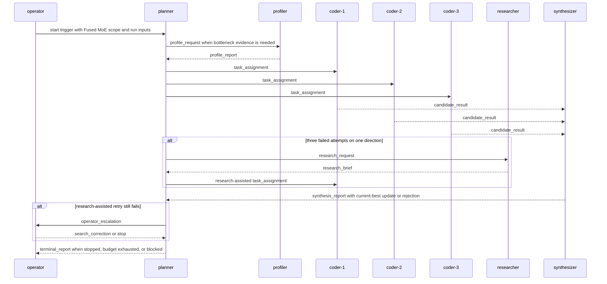

# Collaboration Overview

## Purpose

This is the process-first generated authority for `lead-code-synth-research`. It derives from `../intention/loop-overview.md` and accepted ADRs 0001 through 0006. Later contracts, harness surfaces, skills, and agent bindings must not introduce loop behavior that bypasses this process.

## Topology

Topology mode: `generic-loop`.

The loop has directed routes among `operator`, `planner`, `coder-1`, `coder-2`, `coder-3`, `synthesizer`, `profiler`, and `researcher`. Normal candidate results route to `synthesizer`; promotion reports route to `planner`; operator-origin control can stop, override, repair, or redirect the run. Cycles are bounded by work-item ids, search-direction ids, attempt counts, promotion events, budget exhaustion, blockers, and operator stop.

## Process

```python
def run_fused_moe_loop(run):
    # Runtime input must supply workload scope, allowed edit surface,
    # correctness command, timing command, and baseline/current-best refs.
    state.execution_mode = state.execution_mode or "auto"
    state.run_state = "running"

    while state.run_state == "running":
        # The objective is open-ended speedup maximization.
        # Promotion updates current-best but does not terminate the run.
        direction = planner.choose_search_direction(
            current_best=state.current_best,
            profile_refs=state.latest_profiles,
            run_history=state.run_history,
            operator_constraints=state.operator_constraints,
        )
        work_items = planner.assign_to_coders(
            direction=direction,
            coders=["coder-1", "coder-2", "coder-3"],
        )

        for work_item in work_items:
            send_mail("task_assignment", "planner", work_item.owner, work_item)

        candidate_results = wait_for_candidate_results(work_items)
        # No generated participant waits in-chat. "wait" means later notifier
        # or operator prompts deliver bounded turns until replies arrive.

        if attempts_failed(direction) >= 3 and not direction.research_requested:
            send_mail("research_request", "planner", "researcher", direction)
            direction.research_requested = True
            continue

        synthesis = synthesizer.review_candidates(candidate_results)
        if synthesis.promotable:
            # A candidate is promotable only when correctness passed, evidence is
            # complete, and timing improves over current-best.
            state.current_best = synthesis.candidate_ref
            send_mail("synthesis_report", "synthesizer", "planner", synthesis)
            continue

        if direction.research_requested and synthesis.no_promotable_candidate:
            # Research-assisted retries failed, so the operator decides whether
            # to redirect, repair, override, or stop.
            send_mail("operator_escalation", "planner", "operator", direction)
            apply_operator_control_event()
            continue

        if profile_needed(state.current_best, direction):
            send_mail("profile_request", "planner", "profiler", state.current_best)
            continue

        if operator_stopped() or budget_exhausted() or concrete_blocker_recorded():
            state.run_state = terminal_state()
            send_mail("terminal_report", "planner", "operator", state.summary)
            break
```

## Sequence



## Events And Ticks

- On-event mail skills process one templated mail event selected by `schema_id`, then stop.
- On-tick skills perform one bounded scheduling, reconciliation, timeout, manual-context, or completion pass, then stop.
- Auto mode uses managed Houmao mail notifier prompts as the normal wakeup path.
- Manual mode uses operator prompts for one bounded participant turn while notifier wakeups are suspended or disabled for this loop.

## Terminal Posture

The loop is complete only when the operator stops it, a run budget is exhausted, or the team records a concrete blocker. It does not stop automatically after reproducing the report result, beating a baseline, receiving one promotion, or reaching a fixed no-promotion threshold.

## Recovery Posture

Recovery reads durable state, pending mail refs, run artifacts, and operator intent events. It should resume one bounded action from the active owner when safe, or escalate to the operator when ownership, evidence, or workspace state is inconsistent.
