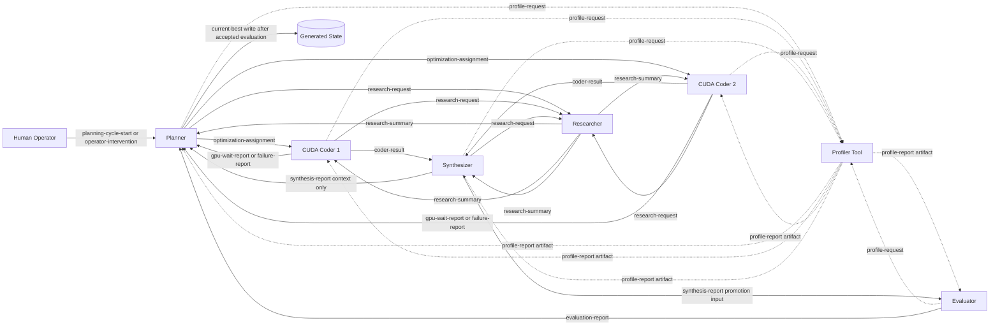

# Topology Graph

The selected topology is `generic-loop`. Planner fans out up to two assignments to symmetric CUDA Coders, Coder results route to Synthesizer, Synthesizer sends promotion reports to Evaluator and context-only copies to Planner, and Evaluator returns accepted or rejected promotion evidence to Planner. Researcher is a request/reply support participant. Profiler is a generated tool surface, not a managed participant node with a mailbox.

