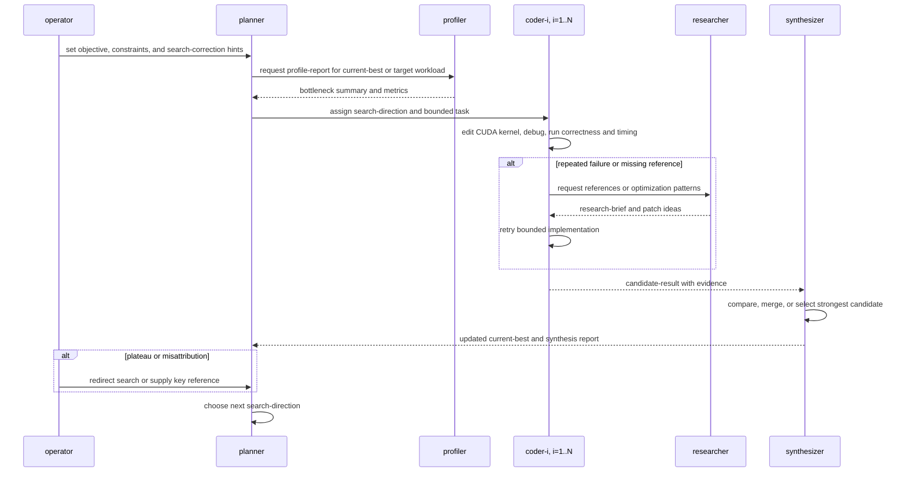

# Lead-Code-Synth-Research Agent Team Idea

## Objective

Optimize MLSys26 FlashInfer contest CUDA kernels through a correctness-first multi-agent workflow modeled on the technical report in `source/mlsys26-tech-report.pdf`. The team should generate, debug, profile, research, and synthesize kernel improvements while keeping humans in an orchestration role: humans define the workflow, enforce correctness and anti-hacking constraints, supply references when needed, and redirect stalled searches, but do not review, edit, or hand-tune kernel code.

## Team Members

- `planner`: Owns the optimization objective, current best kernel, NCU profile summaries, run history, and search direction. It proposes the next optimization directions and assigns bounded implementation tasks to coders.
- `coder-i`: Implements one planner-approved optimization task in an isolated workspace and GPU environment, for `i = 1, 2, ..., N`. It may modify only the CUDA kernel implementation surface, then runs correctness checks, timing, and local debugging before reporting a candidate result.
- `synthesizer`: Reviews coder outputs, checks reported evidence, identifies the strongest candidates and reusable changes, merges or selects the next solution state, and reports the updated solution back into the loop.
- `profiler`: Produces NCU-based performance reports for a selected kernel or workload, attributes bottlenecks, and summarizes profiler evidence for the planner, coders, or synthesizer.
- `researcher`: Performs on-demand reference search when coders or the planner stall. It retrieves external examples, summarizes optimization patterns, and proposes patch ideas without editing kernel code.
- `operator`: External human orchestration role. The operator is not a coding participant; it supplies goals, constraints, references, and search-correction prompts when the team plateaus or misattributes failures.

## Solution Concepts

- `kernel-state`: a concrete candidate implementation plus its provenance, editable files, correctness result, timing result, and benchmark command.
- `current-best`: the fastest correct kernel-state accepted by the synthesizer for the active kernel and workload set.
- `candidate-result`: a coder-produced kernel-state, including what changed, what was tested, failures encountered, speedup numbers, and open risks.
- `profile-report`: an NCU or benchmark-derived bottleneck summary tied to a specific kernel-state and workload.
- `research-brief`: a researcher-produced summary of external references, relevant code patterns, and concrete optimization ideas.
- `search-direction`: a planner-approved optimization direction, such as local bottleneck repair, structural redesign, memory movement reduction, launch-overhead reduction, hardware-specific primitive use, or anti-hacking cleanup.
- `stall`: a repeated failure to improve along the current direction, repeated correctness failures, repeated timeout/runtime failures, or evidence that agents are making only small tweaks after a plateau.

## Constraints

- Correctness gates acceptance. Numerical errors, runtime failures, and timeouts invalidate a candidate-result.
- Benchmark harnesses, datasets, configurations, and reference implementations remain fixed.
- Coders may edit only the intended CUDA kernel implementation surface for the active task.
- Disallow input-identity caching, cross-iteration buffer reuse, dataset-specific shortcuts, benchmark-harness changes, or other non-deployable speedup mechanisms.
- If a legitimate cache is proposed, report cold-path and warm-path performance separately.
- Require every accepted speedup to name the benchmark command, workload scope, correctness result, and baseline comparator.
- Treat profiler and researcher outputs as evidence for search decisions, not as automatic authority to change code.

## Topology

Use a `generic-loop` topology. The report's workflow is not a strict tree because coders can consult the researcher after repeated failures, profiler evidence can be requested by several roles, and the synthesizer closes over coder outputs before the planner redirects the next search direction.

## Coordination Loop

1. `operator` sets the active kernel, workload scope, allowed edit surface, correctness command, timing command, anti-hacking constraints, and any required references.
2. `planner` reads the current-best kernel-state, run history, and latest profile-report, then chooses one or more search-directions.
3. `planner` assigns each `coder-i` a bounded task with the baseline comparator, expected evidence, and allowed files.
4. Each `coder-i` implements and tests its task independently, recording correctness, timing, failures, and code changes.
5. If a coder stalls after several attempts, it asks `researcher` for a research-brief and may retry within the same bounded task.
6. `synthesizer` reviews all candidate-results, rejects invalid or under-evidenced candidates, extracts useful changes, and updates current-best when a candidate is correct and faster.
7. `profiler` profiles the current-best or a selected candidate when the planner or synthesizer needs bottleneck evidence.
8. `planner` uses the synthesis report, profile-report, and run history to decide whether to continue local exploration, switch to structural exploration, request research, or ask the operator for search correction.
9. The loop repeats until the operator stops the run, the budget is exhausted, or the team records that the active kernel is blocked.

## Houmao Definition Notes

- Define participant roles first, then bind concrete agents later under a generated `execplan/agents/` package if this becomes a `houmao-agent-loop-pro` execplan.
- Recommended initial size: one `planner`, one `synthesizer`, one `profiler`, one `researcher`, and three to six `coder-i` agents, depending on available GPU workspaces.
- Give each coder a separate workspace policy so candidate implementations do not overwrite each other.
- Keep `operator` as a runtime authority and not a normal coding agent.
- Install CUDA optimization, profiling, low-precision, and project variant-profiling skills only on roles that need them. The researcher should receive web/reference research skills, while the synthesizer should receive review and evidence-checking skills.
- Make message families explicit: task assignment, candidate result, profile request, profile report, research request, research brief, synthesis report, search correction, and terminal report.
